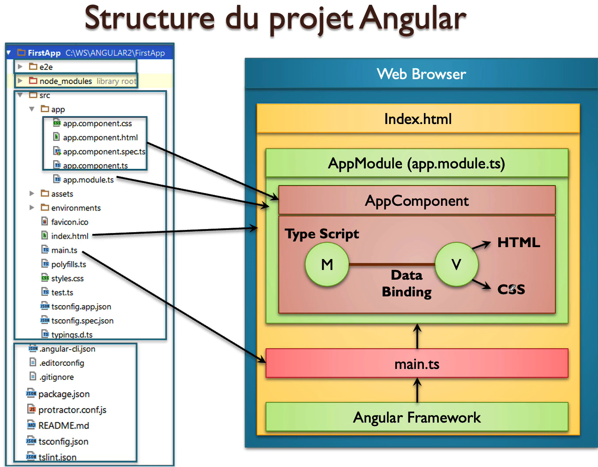

# Angular 
permet de créer la partie front-end des applications web de type __SPA__ (Single Page Application), c’est-à-dire des applications dont l’interface est constituée d’une seule page HTML, généralement `index.html`, et dont le contenu est mis à jour dynamiquement sans rechargement complet de la page.

## npm (node package manager)
__NPM (Node Package Manager)__ est le gestionnaire de paquets officiel de `Node.js`. On peut le comparer à `Maven` dans l’univers `Java`. Il permet principalement de :
-   Installer des bibliothèques JavaScript (comme Angular, React, Express, etc.)

- Gérer les dépendances d’un projet à travers un fichier package.json

- Exécuter des scripts personnalisés pour automatiser des tâches (comme le démarrage du serveur, les tests, la compilation, etc.)


## Angular CLI (Command Line Interface) 
est un outil en ligne de commande officiel pour travailler avec Angular, qui facilite la création, le développement et la gestion d'applications Angular.
installer outil angular/cli : `npm install -g @angular/cli`


## architecture  et  la structure d'un projet  Angular 

__`package.json`__ : C’est le fichier de configuration du projet qui déclare toutes les dépendances et bibliothèques nécessaires à un projet `Angular`. Il est équivalent au fichier `pom.xm`l dans `Maven` pour les projets Java.

__`node_modules`__ : C’est le dossier qui contient toutes les bibliothèques et dépendances d’un projet, déclarées dans le fichier `package.json`.


__``Data Binding``__: C’est un mécanisme basé sur le design `pattern Observable`, où les données affichées dans la `vue` d’un composant sont abonnées (`subscribed`) au `modèle`. Ainsi, dès qu’une donnée change dans le `modèle`, la `vue` est mise à jour automatiquement, sans intervention manuelle.
Ce principe permet une liaison réactive entre les données et l’interface utilisateur, rendant les applications plus dynamiques et fluides.
  <p align="center">
        
  </p>


## Modules :


## commandes  Angular

- __`ng new FirstApp`__ : cette commande permet de générer un projet Angular de base avec tous les fichiers essentiels déjà configurés (structure du projet, dépendances, configuration TypeScript, environnement, etc.). C’est le point de départ idéal pour commencer une nouvelle application Angular.

- __`ng serve`__ : cette commande démarre un serveur de développement local et ouvre automatiquement l’application Angular dans le navigateur. Elle compile le projet, surveille les modifications en temps réel, et rafraîchit la page automatiquement à chaque changement.
En arrière-plan, `Angular CLI` utilise `Webpack`, un outil de bundling, pour rassembler tous les fichiers `JavaScript` en un seul fichier optimisé, et fait de même pour les fichiers `HTML`, CSS et autres ressources. Cela permet de charger l’application plus efficacement dans le navigateur.


- __`ng test`__ : Lance les tests unitaires définis dans le projet Angular à l’aide de Karma (le test runner) et Jasmine (le framework de test).

- __`ng build`__ : Compile l’application Angular en préparation pour la production,elle génère tous les fichiers optimisés (JavaScript, HTML, CSS...) dans le dossier dist/. exemple : 
    ```bash
        ng build --configuration production
    ```

