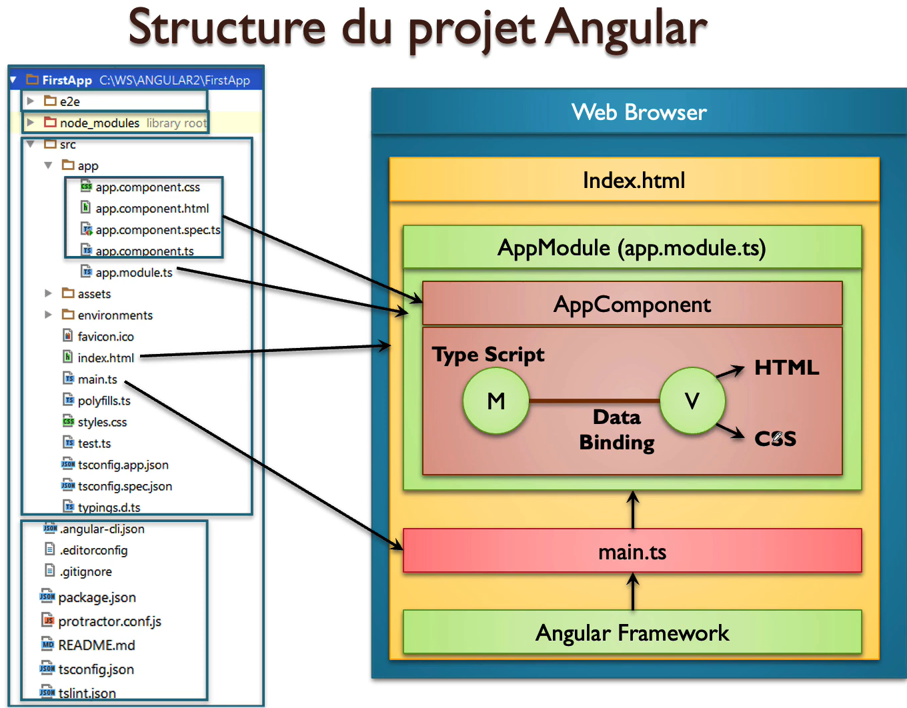
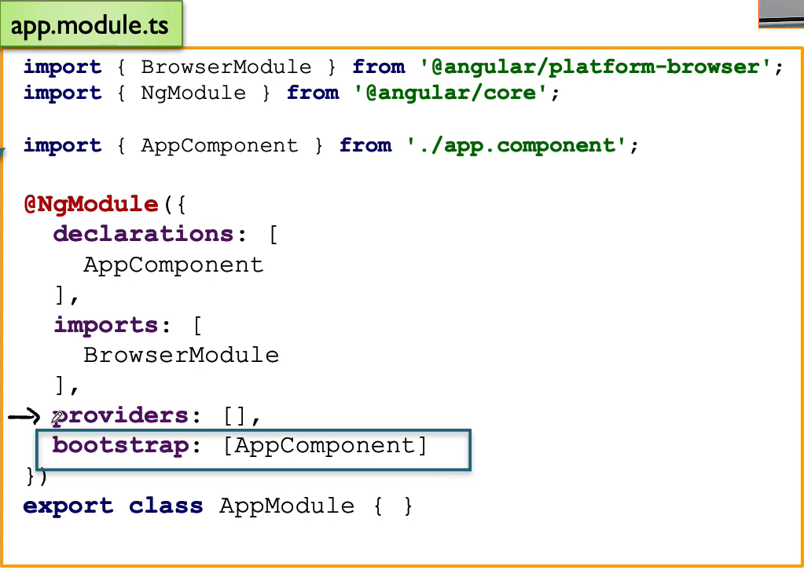
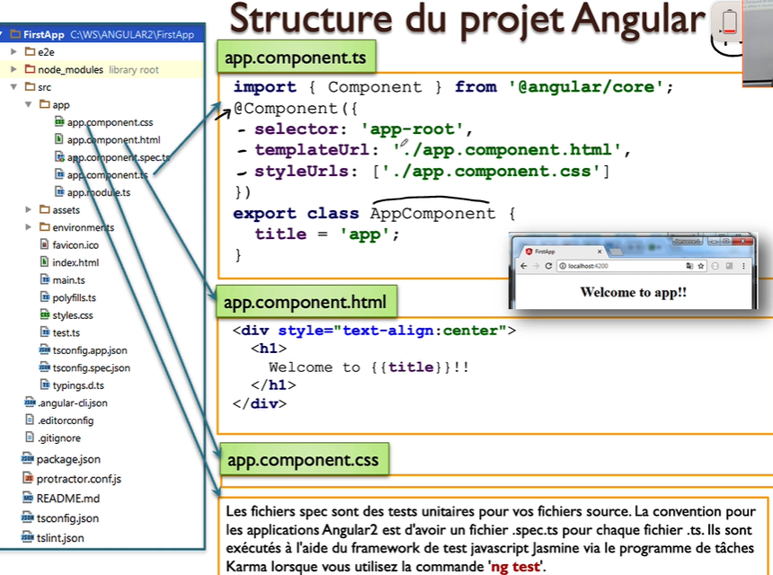
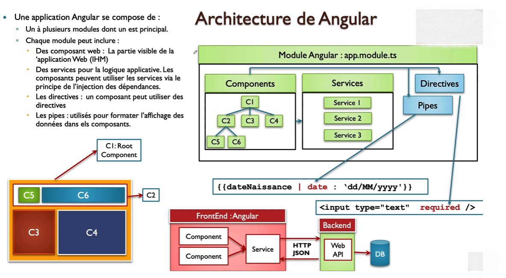
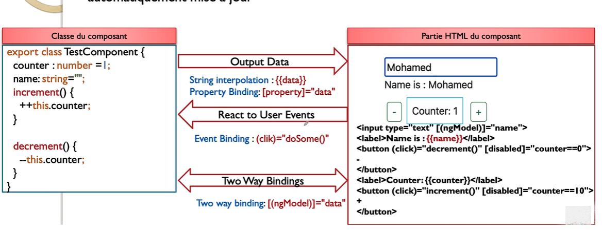

# Angular 
permet de créer la partie front-end des applications web de type __SPA__ (Single Page Application), c’est-à-dire des applications dont l’interface est constituée d’une seule page HTML, généralement `index.html`, et dont le contenu est mis à jour dynamiquement sans rechargement complet de la page.

## npm (node package manager)
__NPM (Node Package Manager)__ est le gestionnaire de paquets officiel de `Node.js`. On peut le comparer à `Maven` dans l’univers `Java`. Il permet principalement de :
-   Installer des bibliothèques JavaScript (comme Angular, React, Express, etc.)

- Gérer les dépendances d’un projet à travers un fichier package.json

- Exécuter des scripts personnalisés pour automatiser des tâches (comme le démarrage du serveur, les tests, la compilation, etc.)


## Angular CLI (Command Line Interface) 
est un outil en ligne de commande officiel pour travailler avec Angular, qui facilite la création, le développement et la gestion d'applications Angular.
installer outil angular/cli : `npm install -g @angular/cli`


## architecture  et  la structure d'un projet  Angular 

__`package.json`__ : C’est le fichier de configuration du projet qui déclare toutes les dépendances et bibliothèques nécessaires à un projet `Angular`. Il est équivalent au fichier `pom.xm`l dans `Maven` pour les projets Java.

__`node_modules`__ : C’est le dossier qui contient toutes les bibliothèques et dépendances d’un projet, déclarées dans le fichier `package.json`.


__``Data Binding``__: C’est un mécanisme basé sur le design `pattern Observable`, où les données affichées dans la `vue` d’un composant sont abonnées (`subscribed`) au `modèle`. Ainsi, dès qu’une donnée change dans le `modèle`, la `vue` est mise à jour automatiquement, sans intervention manuelle.
Ce principe permet une liaison réactive entre les données et l’interface utilisateur, rendant les applications plus dynamiques et fluides. [voir plus](#databinding)


  <p align="center">
        
  </p>

```
```


## 📦 Modules

  
Un module Angular est une classe TypeScript qui permet d’organiser un ensemble de fonctionnalités en regroupant des composants, des directives, des pipes et des services. Il sert à structurer une application Angular de manière modulaire et maintenable.
  
  <p align="center">
        
  </p>


__🎯`@NgModule`__:   est un décorateur qui permet de marquer une classe TypeScript comme un module Angular. Il contient plusieurs propriétés clés :

 -  `declarations` : un tableau qui déclare tous les composants, directives et pipes appartenant à ce module.
 
 - `imports` : un tableau qui permet d’importer d'autres modules (comme CommonModule, FormsModule, ou des modules personnalisés) nécessaires au bon fonctionnement du module courant.

  - `exports` : un tableau qui permet d’exposer un ou plusieurs composants (ou autres éléments) à l’extérieur du module, afin qu’ils puissent être utilisés dans d’autres modules qui l’importent

 - `providers` : un tableau qui déclare les services disponibles pour l’injection de dépendances dans ce module [voir la section Services](#services).

 - `bootsrap` :   utilisé uniquement dans le module principal __`(AppModule)`__, il indique le composant racine à lancer au démarrage de l’application.

## Services  
Angular est un  framwork qui est  fait pour séparer les  concepts  applicatif (traitement de donnes,requete Http..ect  trie...ect )des concepter présentation (UI , HTML, CSS...ect), `les services` donc  sont des class  typescript qui permettent d'imbriquer ses concept applications

un service est une  class  type script ajoutant une annotation `@Injectable()` qui une  annotation pour  décalrer  que c'est un  service qui peut etre  injecter  dans  des coposants  ou  dans d'autre  sercies 


## Componant
un componant ou  un web  compoenent  angular est  un  dossier  qui  englobe  un  certains  nombre de dossier 
  <p align="center">
        
  </p>


 - __`app.component.ts`__ : fichier contenant une classe TypeScript qui représente le **modèle (component)** dans l’architecture **MV** (Model-View). Cette classe est identifiée comme un composant Angular grâce à :

    - __`@Component`__ : un **décorateur de classe** qui indique que la classe est un composant Angular.
    
    - __`selector: 'app-root'`__ : correspond à la **balise personnalisée** qui sera utilisée pour afficher le composant dans un document HTML.  
      Exemple : `<app-root></app-root>`.
      - il existe 3  formes pour inserer selector dans template html 
        - __selector : app-root__   => `<app-root></app-root>`
        - __selector : [app-root]__ => `<div app-root> </div>`
        - __selector : .app-root__  => `<div class=app-root> </div>`
    
    - __`templateUrl`__ ou __`template`__ : permet de définir le contenu HTML du composant.
      - `templateUrl` : spécifie le chemin vers un fichier HTML externe.
      - `template` : contient directement le HTML dans la propriété.
    
    - __`styleUrls: ['chemin-vers-css.css']`__ : tableau contenant les chemins vers les fichiers CSS à appliquer à la vue du composant.

- __`app.component.html`__ : contient le **code HTML** de la vue (template) associée au composant.

- __`app.component.css`__ : contient le **style CSS** appliqué au template du composant.


- __`app.component.spec.ts`__ : fichier contenant les **tests unitaires** du composant Angular, généralement écrits avec **Jasmine** et exécutés avec **Karma**.


<p align="center">
    
</p>

Un **composant** est une **classe TypeScript** qui contient un **`constructor`** utilisé uniquement pour **l’injection de dépendances** (services, par exemple).  
⚠️ Le `constructor` **ne sert pas à initialiser** le composant lui-même.

Pour exécuter du code lors de l’initialisation du composant (après l’injection), la classe doit :

- **implémenter l’interface `OnInit`**
- **redéfinir la méthode `ngOnInit()`**

Exemple :
```ts
export class MonComposant implements OnInit {
  constructor(private monService: MonService) {}

  ngOnInit(): void {
    // Code exécuté à l'initialisation du composant
  }
}
```

## Directives

Ce sont des **fonctionnalités JavaScript encapsulées** derrière un **attribut Angular** permettant d’ajouter un **comportement dynamique** à un composant ou à un élément HTML.

Par exemple :  
- `*ngIf` permet d’afficher ou masquer un élément selon une condition.
- `*ngFor` permet de répéter un élément pour chaque valeur d’une liste.
- `appHighlight` (directive personnalisée) permet de changer le style d’un élément lorsqu’on interagit avec.

Les directives peuvent être :
- **Structurelles** : modifient la structure du DOM (`*ngIf`, `*ngFor`, etc.)
- **D’attribut** : modifient l’apparence ou le comportement d’un élément (`[ngClass]`, `[ngStyle]`, ou une directive personnalisée comme `appHighlight`)

```typescript
    import { Directive, ElementRef, HostListener, Renderer2 } from '@angular/core';

    @Directive({
      selector: '[appHighlight]' // <p appHighlight>...</p>
    })
    export class HighlightDirective {
      constructor(private el: ElementRef, private renderer: Renderer2) {}

      @HostListener('mouseenter') onMouseEnter() {
        this.renderer.setStyle(this.el.nativeElement, 'background-color', 'yellow');
      }

      @HostListener('mouseleave') onMouseLeave() {
        this.renderer.removeStyle(this.el.nativeElement, 'background-color');
      }
    }
```

pour utiliser 
```html
  <p appHighlight>
    Survole-moi pour changer le fond en jaune !
  </p>
```


## Pipes

Un **pipe** en Angular est un **outil de transformation de données** directement dans les **templates HTML**.  
Il permet de modifier l’affichage d’une valeur sans la changer dans le code TypeScript.

Par exemple :
```html
<!-- Transforme le texte en majuscules -->
<p>{{ 'bonjour' | uppercase }}</p> <!-- Affiche : BONJOUR -->
```
pour  faire des `pipes` personnalisé 
```typescript
  import { Pipe, PipeTransform } from '@angular/core';
  @Pipe({
    name: 'capitalize'
  })
  export class CapitalizePipe implements PipeTransform {
    transform(value: string): string {
      if (!value) return '';
      return value.charAt(0).toUpperCase() + value.slice(1).toLowerCase();
    }
  }

```
```html
<p>{{ 'bonjour' | capitalize }}</p>  <!-- Affiche : Bonjour -->
```


## Data Binding

Le **Data Binding** est un mécanisme propre à Angular qui permet de **faire circuler les données entre le modèle (component)** et la **vue (template HTML)**.  
Il peut fonctionner **dans un seul sens** (modèle → vue ou vue → modèle) ou **dans les deux sens** (two-way binding).

<p align="center">
  
</p>

---

### ✨ Exemple de Two-Way Binding :

```html
<input type="text" [(ngModel)]="name">
```

```typescript
  name : string ; 
```
  Chaque modification de l’input met à jour la variable name.

  Chaque changement de la variable name met à jour l’input dans la vue.

  On peut ensuite l’afficher avec de l’interpolation :

```html
  <h1>{{name}}</h1> <!-- on appelle  string interpollation -->
```


### Types de Data Binding en Angular

- __Du composant vers la vue__ 
  - Interpolation :`{{data}}` — insère une valeur dans le HTML.
  - Property Binding :`[property]="data"` — lie une propriété HTML/DOM à une valeur du composant.

- __De la vue vers le composant__  
  - Event Binding : `(event)="function()"` — déclenche une méthode du composant en réponse à un événement.
 
- __Dans les deux sens :__
  - Two-Way Binding : `[(ngModel)]="data"` — synchronise automatiquement le modèle et la vue.


```
```

## Système de routage Angular 
Afin de permettre la navigation entre différents types de composants, Angular met à disposition un système de routage grâce au module `RouterModule`.

__`RouterModule`__ :  est un module fourni par Angular qui permet de gérer la navigation entre les différentes vues (composants) d'une application. Une fois importé dans votre module principal (souvent AppModule) ou dans un module de fonctionnalité, il faut définir les routes dans une constante typée Routes.
```ts
    const routes: Routes = [
      { path: 'home', component: HomeComponent },
      { path: 'about', component: AboutComponent },
      { path: '', redirectTo: '/home', pathMatch: 'full' },
      { path: '**', component: NotFoundComponent }
    ];
```
Cela signifie que lorsque le chemin `(path) `est défini sur "home", la page affiche le composant associé, ici `HomeComponent`.

`redirectTo`: L'attribut redirectTo permet de rediriger l'utilisateur vers un composant par défaut lorsque le chemin est vide. Par exemple :

Pour configurer les routes, on utilise la méthode __`RouterModule.forRoot(appRoutes)`__ dans le tableau imports de votre module principal (AppModule) :
```ts
    @NgModule({
      imports: [RouterModule.forRoot(appRoutes)],
      exports: [RouterModule]
    })
    export class AppRoutingModule {}
```

Pour naviguer entre les routes directement dans le HTML, Angular propose la directive `routerLink` avec la balise `<router-outlet></router-outlet>` afin  d'indiquer  endroit ou le  compsant devrait apparaitre. Voici un exemple :

```html
<button routerLink="/home" class="btn btn-primary">home </button>
<!--balise html -->
<div class="container spacer"> 
  <router-outlet></router-outlet> 
   <!-- <= Cette balise indique à Angular l'emplacement dans le template où le composant correspondant à la route active doit être affiché. En d'autres termes, c'est ici que le contenu lié à chaque route sera injecté dynamiquement.
 -->
</div>
```
ou  bien  directement  via le typescritp il faut injecter le `Router` dans le constructeur ensuite naviger vers la page indiquer

```ts
  Constructor (private router : Router)
  goToHome(){
      this.router.navigate(['home']) // passer à  la page home
  }
```

## HTTP Module
`HttpClientModule` : est un module fourni par Angular qui permet à l’application de communiquer avec un serveur back-end via le protocole HTTP. Il facilite l’envoi de requêtes HTTP telles que `GET`, ``POST``, `PUT`, `DELETE`, etc.
Pour utiliser `HttpClientModule`, il faut l'importer dans le module principal (souvent AppModule) :
```ts
import { HttpClientModule } from '@angular/common/http';

@NgModule({
  imports: [
    HttpClientModule
  ]
})
export class AppModule {}
```
```ts
  // user.service.ts
  import { Injectable } from '@angular/core';
  import { HttpClient } from '@angular/common/http';
  import { Observable } from 'rxjs';
  import { User } from './user.model';

  @Injectable({
    providedIn: 'root'
  })
  export class UserService {
    private apiUrl = 'https://api.example.com/users';

    constructor(private http: HttpClient) {}

    // Méthode GET pour récupérer la liste des utilisateurs
    getUsers(): Observable<User[]> {
      return this.http.get<User[]>(this.apiUrl);
    }

    // Méthode POST pour ajouter un nouvel utilisateur
    addUser(user: User): Observable<User> {
      return this.http.post<User>(this.apiUrl, user);
    }

    // Méthode PUT pour modifier un utilisateur
    updateUser(user: User): Observable<User> {
      return this.http.put<User>(`${this.apiUrl}/${user.id}`, user);
    }

    // Méthode DELETE pour supprimer un utilisateur
    deleteUser(id: number): Observable<void> {
      return this.http.delete<void>(`${this.apiUrl}/${id}`);
    }
  }
```
## Observable


## NOTE 📌 Importation en TypeScript vs Importation en Angular :
`En TypeScript`, l'import sert à importer des classes ou des objets pour les utiliser dans ton code. Par exemple, tu vas importer une classe pour l'utiliser dans ton fichier .ts.
  ```typescript
      // Importation de la classe en TypeScript
      import { CompA } from './comp-a';

      export class SomeClass {
        constructor() {
          const comp = new CompA(); // Utilisation de la classe importée
        }
      }
  ```

`En Angular`, lorsque tu importes un module (avec imports dans @`NgModule`), tu rends accessibles à d'autres modules les composants, directives, pipes (déclarés et exportés dans ce module) afin de les utiliser dans les templates HTML.

Par exemple, si tu veux utiliser CompA dans le template HTML d'un autre module, tu dois déclarer et exporter CompA dans un module, puis importer ce module dans le module où tu veux utiliser le composant :
  ```typescript
          // Déclaration de CompA dans un module (ModuleA)
        @NgModule({
          declarations: [CompA],
          exports: [CompA] // Rendre CompA disponible à l'extérieur du module
        })
        export class ModuleA {}

        // Importation de ModuleA dans un autre module (ModuleB)
        @NgModule({
          imports: [ModuleA]
        })
        export class ModuleB {}  
  ```
Ensuite, dans le template HTML de ModuleB, tu pourras utiliser `<app-comp-a>`
  
 ```html
 <app-comp-a></app-comp-a>  <!-- Utilisation du composant CompA dans le template --> 
 ``` 

__TypeScript (import { CompA } from './comp-a')__ : Pour importer la classe et l'utiliser dans ton code .ts (logique).

__Angular (exports: [CompA])__ : Pour exporter des composants dans des templates HTML.


```
```


## commandes  Angular

- __`ng new FirstApp`__ : cette commande permet de générer un projet Angular de base avec tous les fichiers essentiels déjà configurés (structure du projet, dépendances, configuration TypeScript, environnement, etc.). C’est le point de départ idéal pour commencer une nouvelle application Angular.

- __`ng serve`__ : cette commande démarre un serveur de développement local et ouvre automatiquement l’application Angular dans le navigateur. Elle compile le projet, surveille les modifications en temps réel, et rafraîchit la page automatiquement à chaque changement.
En arrière-plan, `Angular CLI` utilise `Webpack`, un outil de bundling, pour rassembler tous les fichiers `JavaScript` en un seul fichier optimisé, et fait de même pour les fichiers `HTML`, CSS et autres ressources. Cela permet de charger l’application plus efficacement dans le navigateur.


- __`ng test`__ : Lance les tests unitaires définis dans le projet Angular à l’aide de Karma (le test runner) et Jasmine (le framework de test).

- __`ng build`__ : Compile l’application Angular en préparation pour la production,elle génère tous les fichiers optimisés (JavaScript, HTML, CSS...) dans le dossier dist/. exemple : 
    ```bash
        ng build --configuration production
    ```

- __`ng generate component | ng g c [component name]`__ : génère un composant Angular avec le nom spécifié.

- __`ng generate service | ng g s [service name]`__ : génère un service Angular avec le nom spécifié.


- __`ng generate pipe | ng g p [pipe name]`__ : génère un pipe Angular avec le nom spécifié.

- __`ng generate module | ng g m [module name]`__ : génère un module Angular avec le nom spécifié.