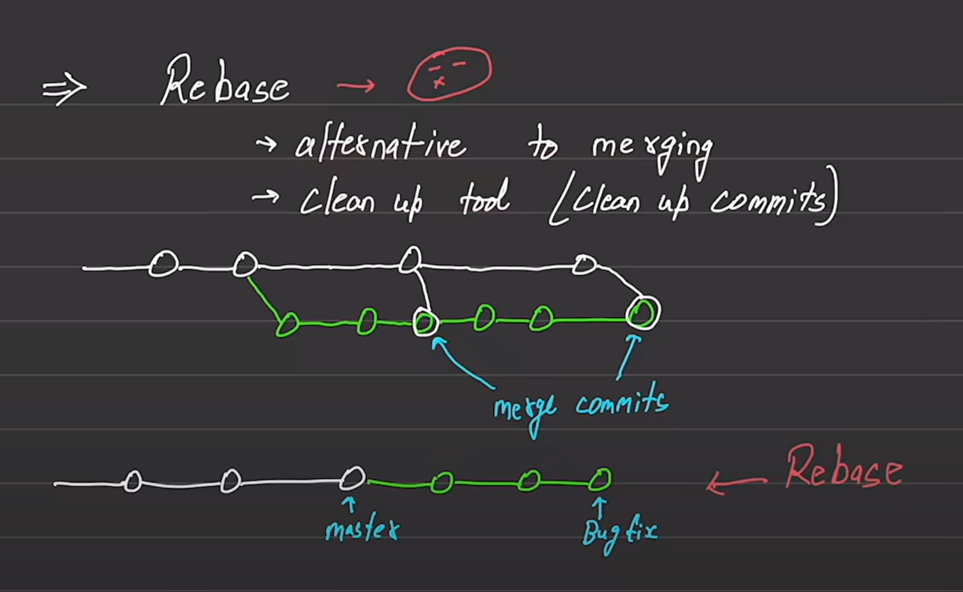

# Commandes   (Git)
- différents work  spaces  de git ! 

<p align="center">
  
</p>


- `git status` : affiche les fichiers et dossiers qui ne sont pas encore suivis (untracked) ou ceux qui ont été modifiés mais ne sont pas encore ajoutés à la *staging area*.

- `git log` : affiche l'historique complet des commits.

    - `git log --oneline` : affiche l'historique des commits sous forme condensée, chaque commit tenant sur une seule ligne.

    - `git log -n 2` : affiche uniquement les deux derniers commits.

- `git restore` : Restauration du working directory

    La commande git restore permet de restaurer le répertoire de travail (working directory) en le réinitialisant à l'état du dernier commit. Elle possède deux options principales :


    - `--staged` : retire les fichiers de la **staging area**, les ramenant dans le working directory sans supprimer les modifications.

        ```bash
        git restore test.txt --staged #supprimer test.txt de la staging area (resotrer le fichier dans mon work space)
        ```

    - `--source`: resotore le fichier  depuis un commit source 

        ```bash
           git restore --source=3a7e1c2 # monFichier.java restorer le fichier (monfichier) dpuis le commit 3a7e1c2
        ```

- `git branch <branch_name>`: creer une  branch `branch_name`;
- `git branch -d <branch_name>`: supprimer la  branche `branch_name`;

- `git diff <fichier | dossier>` : affiche les différences entre le contenu actuel et l'index (staging area) pour un fichier ou un dossier spécifique.
    - `git diff --staged` :affiche les différences entre l’index (staging area) et le dernier commit (HEAD), c’est-à-dire les changements prêts à être commités 
    - `git diff <commit_id_1> <commit_id_2>` :affiche les différences entre deux commits spécifiques.


- `git stash` enregistre temporairement les modifications non commités dans une pile (stash) et restaure l’arborescence de travail à l’état du dernier commit. Utile avant de changer de branche.

- `git stash push -m "WIP: correction bug login"` git a message to stash


- `git stash list` :   liste tous les éléments enregistrés dans le stash avec leurs identifiants (ex : `stash@{0}`). 

- `git stash pop [<stash_id>]` : restaure les modifications depuis le stash (par défaut le dernier), puis supprime l’entrée du stash.


- `git stash apply`  restaure les modifications depuis le stash sans supprimer l’entrée (contrairement à `pop`).

## Merge

<p align="center">
  
</p>


-   pour merger  la branche  `feature` dans  la  branche `master` 
```bash
    git checkout master # depalcer dans  la branche ou  je veux avoir mes  modifs
    git merge feature
```
   - le ` git merge` mege aussi les  commits  des  deux branch dans la branche  cible 

## Conflicts 

Tout ce qui se trouve entre ``<<<<<< HEAD et ======`` correspond aux modifications faites dans la branche principale (courante), tandis que tout ce qui est entre`` ====== et >>>>>> bugFix`` correspond aux modifications de la nouvelle branche que l'on souhaite fusionner.


<p align="center">
  
</p>


## Git Rebase

`git rebase` est une commande Git puissante qui permet de rejouer les commits d'une branche par-dessus une autre branche, comme si tu avais commencé à travailler à partir de cette autre branche depuis le début.

<p align="center">
  
</p>


### différence entre `git merge` et `git rebase`

 _exemple_ : 
 - situation initiale
     ```bash         
            main:     A---B---C
            feature:       \---D---E
      ```
  - Avec `git merge` feature (sur la branche feature) :
    ```bash
      main:     A---B---C------- M  (commit de fusion)    
      feature:       \---D---E /
    ```
 
  - Avec `git rebase` main : (D' et E' sont des nouveaux commits, équivalents à D et E mais repositionnés sur main.)
    ```bash
      main:     A---B---C---D'---E'
    ```

__Note :__ Le merge fonctionne différemment du rebase :

  Par exemple, si nous avons deux branches `main` et `feature`, pour intégrer les modifications de `feature` dans `main` (c'est-à-dire de `feature` vers `main`), il faut être dans la branche `main` et exécuter la commande  `git merge feature`.

  Maintenant, si l'on souhaite intégrer les modifications de `feature` dans `main` tout en conservant un historique linéaire, il faut être dans `feature` et exécuter  `git rebase main`.


## Configuration

- Configurer l'email et le nom :
    ```bash
    git config --global user.name "rocks.D.Xebec"  
    git config --global user.email "rocks.D.Xebec@example.com"
    ```

- Afficher l'email et le nom configurés :
    ```bash
    git config --global user.name  
    git config --global user.email
    ```

- Configurer un éditeur :
    ```bash
    git config --global core.editor "code --wait"
    ```
    > `--wait` est une option qui permet à Git de **suspendre l'exécution** jusqu'à ce que l'éditeur soit **fermé après enregistrement**, au lieu de continuer immédiatement.
