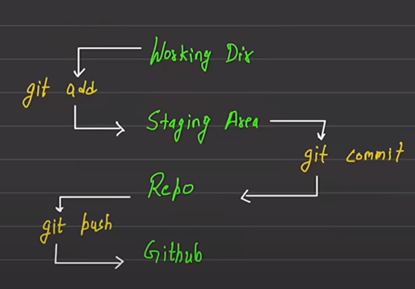

# Commandes   (Git)
- différents work  spaces  de git ! 

<p align="center">
  
</p>


- `git status` : affiche les fichiers et dossiers qui ne sont pas encore suivis (untracked) ou ceux qui ont été modifiés mais ne sont pas encore ajoutés à la *staging area*.

- `git log` : affiche l'historique complet des commits.

    - `git log --oneline` : affiche l'historique des commits sous forme condensée, chaque commit tenant sur une seule ligne.

    - `git log -n 2` : affiche uniquement les deux derniers commits.

- `git restore` : restaure le working directory (espace de travail) en le remettant dans l’état du **dernier commit**.

    - `--staged` : retire les fichiers de la **staging area**, les ramenant dans le working directory sans supprimer les modifications.


## Configuration

- Configurer l'email et le nom :
    ```bash
    git config --global user.name "rocks.D.Xebec"  
    git config --global user.email "rocks.D.Xebec@example.com"
    ```

- Afficher l'email et le nom configurés :
    ```bash
    git config --global user.name  
    git config --global user.email
    ```

- Configurer un éditeur :
    ```bash
    git config --global core.editor "code --wait"
    ```
    > `--wait` est une option qui permet à Git de **suspendre l'exécution** jusqu'à ce que l'éditeur soit **fermé après enregistrement**, au lieu de continuer immédiatement.
