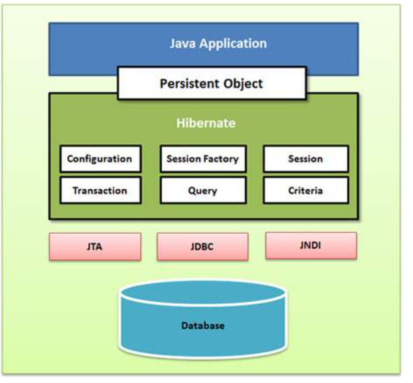

# <h1 align="center">hibernate </h1>
Hibernate est un outil Java de mapping objet-relationnel (ORM - Object-Relational Mapping), qui permet de simplifier l'interaction avec une base de données relationnelle en mappant les objets Java aux tables de la base de données.


## Principaux concepts d'Hibernate :
__1. Mapping Objet-Relationnel (ORM)__ : Hibernate facilite la conversion des objets Java en enregistrements dans des tables de bases de données et inversement.

__2. Sessions Hibernate__ : Hibernate utilise une session pour gérer les objets persistants. C'est un conteneur qui permet de récupérer, persister, mettre à jour ou supprimer des objets dans la base de données.

__3. HQL (Hibernate Query Language)__ : Hibernate offre un langage de requête orienté objet, HQL, qui permet de manipuler les données sous forme d'objets, plutôt que d'utiliser SQL classique.

## <h2 align="center"> Architecture  de  Hibernet </h2> 

<p align="center">
    
</p>

### 1. Configuration: 
`Configuration`: C'est le premier objet créé par l'application Hibernate. Il représente la configuration d'Hibernate dans le fichier de propriétés.

L'objet `Configuration` fournit deux informations importantes :

 1. **Database Connection** : Cela est géré par un ou plusieurs fichiers de configuration pris en charge par Hibernate. Ces fichiers sont `hibernate.properties` et `hibernate.cfg.xml`.

2. **Class Mapping Setup** : Ce composant crée la connexion entre les classes Java et les tables de la base de données.

L'objet `Configuration` est utilisé pour configurer Hibernate et initialiser les paramètres nécessaires à la gestion des connexions à la base de données et des mappings des classes.


### 2. Transaction Object :
est un mécanisme permettant de gérer les opérations de la base de données dans un environnement Hibernate. Elle s'assure que les modifications apportées à la base de données sont effectuées de manière cohérente, atomique et fiable. Une transaction Hibernate peut inclure plusieurs opérations de base de données comme des insertions, mises à jour ou suppressions.


```java
    import org.hibernate.cfg.Configuration;
    import org.hibernate.SessionFactory;

    public class HibernateExample {
        public static void main(String[] args) {
            // Créer l'objet Configuration
            Configuration configuration = new Configuration();
            
            // Charger la configuration depuis un fichier XML (hibernate.cfg.xml)
            configuration.configure("hibernate.cfg.xml");
            
            // Créer une SessionFactory à partir de la configuration
            SessionFactory sessionFactory = configuration.buildSessionFactory();
            
            // Utiliser la sessionFactory pour ouvrir une session et effectuer des opérations sur la base de données
            Session session = sessionFactory.openSession();
            session.beginTransaction();
            
            // Exécution de la logique de base de données ici (par exemple, sauvegarde, recherche, etc.)
            
            session.getTransaction().commit();
            session.close();
            
            // Fermer la SessionFactory après utilisation
            sessionFactory.close();
        }
    }
```    

### 3.Session Hibernet 
La `session Hibernate` est un objet léger utilisé pour communiquer avec la base de données.
À chaque interaction avec la base, un objet `Session` est instancié et utilisé pour récupérer des données ou persister des données.

En d’autres termes, lorsqu’une requête est soumise à Hibernate, il ouvre une session pour cette requête (dans laquelle les données sont chargées), soit pour les insérer (dans le cas d’un `INSERT`), soit pour les afficher (dans le cas d’un `SELECT`).

Les objets Session ne doivent pas rester ouverts trop longtemps, car ils ne sont généralement pas thread-safe (c’est-à-dire qu’ils ne supportent pas l’accès concurrent).
Ils doivent donc être créés et détruits au besoin, selon le cycle de vie des opérations.

__La fonction principale d’un objet Session__ : est de permettre les opérations de création, lecture, mise à jour et suppression (CRUD) sur les instances des classes d’entités mappées  

Une instance  d'un object peut  avoir 3 cas  dans une  session hibernet 
- __`transient`__ :  une instance nouvellement créée d’une classe persistante, non associée à une Session, sans identifiant et sans représentation en base de données, est considérée comme transient par Hibernate.

    🔹 exemple de  Transient (objet non enregistré, non géré par Hibernate)
    ```java
        User user = new User();       // nouvel objet
        user.setName("Halim");        // on lui donne une valeur

        // À ce stade :
        // - Pas d'identifiant (id == null)
        // - Pas lié à une session Hibernate
        // - Pas encore en base de données
    ```
- __`Persistent`__:  une instance `transient` devient `persistente` lorsqu’elle est associée à une `Session Hibernate`. Une instance persistente a un `identifiant`, une représentation dans la base de données, et elle est gérée par la Session.

   🔸 2. Persistent (objet géré par Hibernate, lié à la session)
   ```java
        Session session = sessionFactory.openSession();
        session.beginTransaction();

        session.save(user);           // l'objet devient "persistent"
        session.getTransaction().commit();

        // À ce stade :
        // - L'objet a un id (généré par la BDD)
        // - Il est synchronisé avec la base
        // - Toutes les modifications seront suivies par Hibernate
        
        // ------- 
        List<User> users = session.createQuery("from User", User.class).list();
   ```
- __`Detached`__ : lorsqu’une Session est fermée, les objets persistents qu’elle gérait deviennent des instances détachées (detached). Cela signifie qu’ils conservent leurs données et leur identifiant, mais ne sont plus liés à une Session active.

    3. Detached (objet plus géré par la session, mais toujours existant)
    ```java
        session.close();              // on ferme la session
        user.setName("Yahiaoui");     // on modifie l'objet, mais Hibernate ne le voit pas

        // L'objet est maintenant detached :
        // - Il a toujours un id
        // - Il existe en base
        // - Mais Hibernate ne le suit plus    
    ```
    Pour le remettre sous gestion Hibernate (le "reattacher"), on peut faire :
    ```java
        Session newSession = sessionFactory.openSession();
        newSession.beginTransaction();
        newSession.update(user);      // ou merge(user)
        newSession.getTransaction().commit();
    ```
[Voir la section "Hibernate Session – Méthodes principales"](#hibernate-session--méthodes-principales)


### 4. SessionFactory en Hibernate

Le `SessionFactory` est un objet lourd qui est créé par Hibernate au démarrage de l'application et qui est **thread-safe**. Son principal objectif est de créer des sessions et de gérer la `configuration partagée`.il gère la création et la configuration des sessions et leur cycle de vie.
```java
SessionFactory sessionFactory = new Configuration().configure().buildSessionFactory();
Session session = sessionFactory.openSession(); // pour obtenir la session courante
```
⚠️ On ne recrée jamais le SessionFactory à chaque requête ! Il doit rester actif pendant toute la durée de vie de l'application

### 5.Query Object
Les objets `Query` utilisent des chaînes `SQL` ou `HQL (Hibernate Query Language)`pour interroger la base de données et créer des objets à partir des résultats.
Une instance de Query permet de :
- Lier des paramètres à la requête
- Limiter le nombre de résultats retournés,
- Exécuter la requête et récupérer les données.

 En résumé, `Query` offre un moyen souple et puissant d’interagir avec la base de données en utilisant soit du SQL natif, soit le langage orienté objet HQL.


## 6. Criteria Object
Les objets Criteria sont utilisés pour créer et exécuter des requêtes orientées objet afin de récupérer des entités depuis la base de données.
Une instance de Criteria permet de :
- Construire dynamiquement des requêtes sans écrire de SQL ou HQL,
- Ajouter des conditions (restrictions), des tris (order), ou des jointures,
- Exécuter la requête pour obtenir des objets correspondant aux critères définis.

`Criteria` est particulièrement utile lorsque les requêtes doivent être générées dynamiquement à l'exécution, en fonction de filtres ou de paramètres utilisateurs.

```java
Session session = sessionFactory.openSession();
CriteriaBuilder builder = session.getCriteriaBuilder();
CriteriaQuery<User> criteria = builder.createQuery(User.class);
Root<User> root = criteria.from(User.class);

// Ajouter des conditions dynamiquement
List<Predicate> predicates = new ArrayList<>();

if (filtrerParVille) {
    predicates.add(builder.equal(root.get("city"), "Lyon"));
}
if (filtrerParAge) {
    predicates.add(builder.between(root.get("age"), 20, 30));
}

criteria.select(root).where(predicates.toArray(new Predicate[0]));

// Exécuter la requête
List<User> results = session.createQuery(criteria).getResultList();
```

## <h2 align="center"> Configuration </h2> 
Hibernate a besoin de deux types d’informations pour fonctionner correctement :
1. Le mapping entre les classes Java et les tables de la base de données.
2. Les paramètres de configuration liés à la connexion à la base et au comportement de l’ORM.

Ces informations sont généralement fournies à travers :
- un fichier `hibernate.cfg.xml` (le plus courant),
- ou un fichier `hibernate.properties`

__🧩 Exemple de fichier hibernate.cfg.xml__ : 
```xml
<?xml version='1.0' encoding='utf-8'?>
<!DOCTYPE hibernate-configuration PUBLIC
        "-//Hibernate/Hibernate Configuration DTD 3.0//EN"
        "http://hibernate.sourceforge.net/hibernate-configuration-3.0.dtd">
<hibernate-configuration>
  <session-factory>
    <!-- JDBC Database connection settings -->
        <property name="hibernate.connection.driver_class">com.mysql.cj.jdbc.Driver</property>
        <property name="hibernate.connection.url">jdbc:mysql://localhost:3306/your_database</property>
        <property name="hibernate.connection.username">your_username</property>
        <property name="hibernate.connection.password">your_password</property>

        <!-- JDBC connection pool settings -->
        <property name="hibernate.c3p0.min_size">5</property>
        <property name="hibernate.c3p0.max_size">20</property>

        <!-- Specify dialect -->
        <property name="hibernate.dialect">org.hibernate.dialect.MySQLDialect</property>

        <!-- Enable Hibernate's automatic session context management -->
        <property name="hibernate.current_session_context_class">thread</property>

        <!-- Echo all executed SQL to stdout -->
        <property name="hibernate.show_sql">true</property>

        <!-- Drop and re-create the database schema on startup -->
        <property name="hibernate.hbm2ddl.auto">update</property>

        <!-- Enable Hibernate's automatic session context management -->
        <property name="hibernate.c3p0.idle_test_period">3000</property>

  </session-factory>
</hibernate-configuration>
```

- `hibernate.cfg.xml` centralise la configuration technique (connexion DB, dialecte, options).

- Il contient aussi la liste des classes annotées ou mappées à des tables.

- Hibernate lit ce fichier au démarrage de l’application pour créer le `SessionFactory`.
```properties
    hibernate.connection.driver_class=org.postgresql.Driver
    hibernate.connection.url=jdbc:postgresql://localhost:5432/ma_base
    hibernate.connection.username=utilisateur
    hibernate.connection.password=motdepasse

    hibernate.dialect=org.hibernate.dialect.PostgreSQLDialect
    hibernate.show_sql=true
    hibernate.format_sql=true
```

### Propriétés Hibernate 

Voici la liste des propriétés importantes que vous devrez configurer pour une base de données dans une situation autonome :

| N° | Propriétés & Description |
|----|--------------------------|
| 1  | **hibernate.dialect** <br> Cette propriété permet à Hibernate de générer le SQL approprié pour la base de données choisie. |
| 2  | **hibernate.connection.driver_class** <br> La classe du pilote JDBC. |
| 3  | **hibernate.connection.url** <br> L'URL JDBC vers l'instance de la base de données. |
| 4  | **hibernate.connection.username** <br> Le nom d'utilisateur de la base de données. |
| 5  | **hibernate.connection.password** <br> Le mot de passe de la base de données. |
| 6  | **hibernate.connection.pool_size** <br> Limite le nombre de connexions en attente dans le pool de connexions JDBC de Hibernate. |
| 7  | **hibernate.connection.autocommit** <br> Permet d'utiliser le mode autocommit pour la connexion JDBC. |


## 🔧 Propriété hbm2ddl.auto (Hibernate)
La propriété hbm2ddl.auto permet de configurer comment Hibernate gère le schéma de la base de données à partir des entités Java.

__📜 Valeurs possibles :__
| Valeur        | Description                                                                                                                                                                                       |
| ------------- | ------------------------------------------------------------------------------------------------------------------------------------------------------------------------------------------------- |
| `create`      | Hibernate crée les tables **à chaque démarrage** de l’application. Si une table existe déjà, elle est **supprimée** (avec ses données) puis **recréée**. ⚠️ **Attention à la perte de données !** |
| `update`      | Hibernate **modifie les tables existantes** pour qu’elles correspondent aux entités. Si une table n'existe pas, elle est **créée**. C’est le mode le plus utilisé en développement.               |
| `validate`    | Hibernate **vérifie uniquement** que le schéma (tables/colonnes) correspond aux entités. Si ce n’est pas le cas, une **exception est levée**. Aucune modification n’est faite sur la base.        |
| `create-drop` | Hibernate crée les tables au démarrage **et les supprime à l'arrêt** de l'application. Utile uniquement pour des **tests automatiques ou unitaires**.                                             |
| `none`        | Hibernate **ne fait rien du tout** concernant le schéma. La base doit déjà exister et être conforme. Mode recommandé en **production**.                                                           |

**utilisation**
| Environnement | Recommandation            |
| ------------- | ------------------------- |
| Développement | `update` ou `create-drop` |
| Test unitaire | `create-drop`             |
| Production    | `validate` ou `none`      |


## 🗣️ Hibernate Dialect – Le dialecte de base de données
📘 Qu'est-ce qu'un Dialecte ?

Un `dialecte de base de données` est une configuration utilisée par Hibernate pour générer les requêtes SQL adaptées au SGBD (Système de Gestion de Base de Données) que vous utilisez.

Chaque SGBD (MySQL, PostgreSQL, Oracle, etc.) a ses propres particularités syntaxiques (types de données, mots-clés, fonctions, etc.). Le dialecte permet à Hibernate de traduire le SQL générique en SQL spécifique à votre base de données.

```xml
<property name="hibernate.dialect">org.hibernate.dialect.PostgreSQLDialect</property>
```
[__📚 voir Principaux dialectes disponibles__](#dialect-base-de-donnes)


## DATA SOURCE
Une __`DataSource`__ est une interface de Java qui représente une source de connexions à une base de données. Elle est utilisée pour obtenir des connexions `JDBC (Java Database Connectivity)` à une base de données. En d'autres termes, une `DataSource` est un objet qui gère la connexion à une base de données et qui permet d'obtenir des connexions de manière efficace.

**Rôle d'une DataSource**
 
- ``Gestion des connexions`` : La DataSource est responsable de la gestion des connexions à la base de données, notamment de leur création, leur gestion, et leur destruction lorsque nécessaire. Contrairement à l'utilisation classique de DriverManager pour obtenir des connexions, une DataSource est généralement plus performante et plus souple.

- `Pooling des connexions` : La DataSource peut être utilisée avec un pool de connexions, ce qui permet de réutiliser les connexions à la base de données au lieu de les créer à chaque demande, réduisant ainsi le coût des opérations et améliorant la performance.

- `Configuration centralisée` : Elle permet de centraliser la configuration des connexions à la base de données, ce qui est très utile dans des environnements comme les serveurs d'applications, où plusieurs applications peuvent partager les mêmes configurations de connexion.

**Types de DataSource**

Il existe plusieurs types de DataSource en fonction du contexte d'utilisation :

1. `DataSource standard JDBC` : Il s'agit d'une interface simple pour obtenir des connexions JDBC. Par exemple, org.apache.tomcat.jdbc.pool.DataSource est une implémentation courante de DataSource pour Tomcat.

2. `DataSource avec Pooling` : Les implémentations comme HikariCP, C3P0, et Apache DBCP fournissent des fonctionnalités de pooling, ce qui permet de gérer un ensemble de connexions à la base de données et de réutiliser ces connexions.

3. `DataSource dans un serveur d'application (JNDI)` : Dans les environnements d'entreprise, comme avec des serveurs d'applications tels que Tomcat, WildFly ou WebLogic, les connexions sont souvent gérées via JNDI (Java Naming and Directory Interface). Cela permet de centraliser la gestion des connexions au niveau du serveur d'application.

```java
    import javax.sql.DataSource;
    import org.apache.tomcat.jdbc.pool.DataSource;

    public class DataSourceExample {
        public static void main(String[] args) {
            // Création de la DataSource
            DataSource dataSource = new DataSource();
            dataSource.setUrl("jdbc:mysql://localhost:3306/mydatabase");
            dataSource.setUsername("user");
            dataSource.setPassword("password");

            // Obtenir une connexion
            try (Connection connection = dataSource.getConnection()) {
                // Utilisation de la connexion pour interagir avec la base de données
                System.out.println("Connexion réussie à la base de données !");
            } catch (SQLException e) {
                e.printStackTrace();
            }
        }
    }
```

__les implémentations peuvent venir de :__
- un serveur d’application : qui fournit une DataSource via JNDI (Tomcat, GlassFish…),
- une lib Java dans une app standalone : comme HikariCP, C3P0, Apache DBCP, etc.


**Configuration des propriétés** 

pour l'utilisation d'une base de données avec un serveur d'application et JNDI
Si vous utilisez une base de données avec un serveur d'application et JNDI (Java Naming and Directory Interface), vous devrez configurer les propriétés suivantes :

| **N°** | **Propriétés & Description**                                                                                                                                                                                                                                                                                                                      |
| ------ | ------------------------------------------------------------------------------------------------------------------------------------------------------------------------------------------------------------------------------------------------------------------------------------------------------------------------------------------------- |
| 1      | **hibernate.connection.datasource**<br> Le nom JNDI défini dans le contexte du serveur d'application, utilisé par l'application. Cela fait référence à la ressource de connexion à la base de données définie dans le serveur d'application, ce qui permet à Hibernate de récupérer automatiquement les connexions à la base de données via JNDI. |
| 2      | **hibernate.jndi.class**<br> La classe `InitialContext` pour JNDI, qui est responsable de l'accès aux ressources définies dans JNDI. Elle permet à Hibernate de se connecter au serveur JNDI et de récupérer les ressources nécessaires.                                                                                                          |
| 3      | **hibernate.jndi.<JNDIpropertyname>**<br> Permet de passer n'importe quelle propriété JNDI à `InitialContext` pour configurer davantage la manière dont JNDI interagit avec votre application. Cela peut inclure des informations comme les paramètres de sécurité, les propriétés spécifiques au fournisseur JNDI, etc.                          |
| 4      | **hibernate.jndi.url**<br> Fournit l'URL JNDI utilisée pour localiser le serveur d'application JNDI. Cette URL permet à Hibernate de se connecter à un serveur JNDI distant ou local, où sont stockées les configurations des ressources, telles que la connexion à la base de données.                                                           |
| 5      | **hibernate.connection.username**<br> Le nom d'utilisateur de la base de données utilisé pour établir une connexion avec la base de données. Il est souvent spécifié directement dans le fichier de configuration ou récupéré via JNDI.                                                                                                           |
| 6      | **hibernate.connection.password**<br> Le mot de passe de la base de données correspondant à l'utilisateur pour la connexion. Tout comme le nom d'utilisateur, il peut être configuré dans le fichier de configuration ou récupéré via JNDI.                                                                                                       |


## <h2 align="center"> Hibernate Session – Méthodes principales </h2>

| N°  | Méthode                                       | Description |
|-----|-----------------------------------------------|-------------|
| 1   | `Transaction beginTransaction()`              | Démarre une unité de travail et retourne l’objet `Transaction` associé. |
| 2   | `void cancelQuery()`                          | Annule l’exécution de la requête en cours. |
| 3   | `void clear()`                                | Vide complètement la session. |
| 4   | `Connection close()`                          | Termine la session en libérant la connexion JDBC et en nettoyant les ressources. |
| 5   | `Criteria createCriteria(Class persistentClass)` | Crée une nouvelle instance de `Criteria` pour une classe d’entité donnée. |
| 6   | `Criteria createCriteria(String entityName)`  | Crée une nouvelle instance de `Criteria` pour un nom d’entité donné. |
| 7   | `Serializable getIdentifier(Object object)`   | Retourne la valeur de l’identifiant de l’entité fournie. |
| 8   | `Query createFilter(Object collection, String queryString)` | Crée une instance de `Query` pour une collection et une chaîne de filtre donnée. |
| 9   | `Query createQuery(String queryString)`       | Crée une instance de `Query` à partir d’une requête HQL. |
| 10  | `SQLQuery createSQLQuery(String queryString)` | Crée une instance de `SQLQuery` pour une requête SQL native. |
| 11  | `void delete(Object object)`                  | Supprime une instance persistante de la base de données. |
| 12  | `void delete(String entityName, Object object)` | Supprime une instance persistante de la base de données via son nom d’entité. |
| 13  | `Session get(String entityName, Serializable id)` | Récupère une instance persistante par nom d’entité et identifiant. |
| 14  | `SessionFactory getSessionFactory()`          | Retourne la `SessionFactory` qui a créé cette session. |
| 15  | `void refresh(Object object)`                 | Recharge l’état de l’objet à partir de la base de données. |
| 16  | `Transaction getTransaction()`                | Retourne l’objet `Transaction` associé à la session. |
| 17  | `boolean isConnected()`                       | Vérifie si la session est actuellement connectée. |
| 18  | `boolean isDirty()`                           | Vérifie si la session contient des changements à synchroniser avec la base. |
| 19  | `boolean isOpen()`                            | Vérifie si la session est encore ouverte. |
| 20  | `Serializable save(Object object)`            | Persiste une instance transiente et lui assigne un identifiant généré. |
| 21  | `void saveOrUpdate(Object object)`            | Sauvegarde ou met à jour l’instance selon son état. |
| 22  | `void update(Object object)`                  | Met à jour une instance détachée avec son identifiant. |
| 23  | `void update(String entityName, Object object)` | Met à jour une instance détachée via son nom d’entité. |


## dialect Base de donnes
| Base de données                    | Propriété du dialecte Hibernate               |
| ---------------------------------- | --------------------------------------------- |
| Caché 2007.1                       | `org.hibernate.dialect.Cache71Dialect`        |
| IBM DB2                            | `org.hibernate.dialect.DB2Dialect`            |
| DB2/390                            | `org.hibernate.dialect.DB2390Dialect`         |
| DB2/400                            | `org.hibernate.dialect.DB2400Dialect`         |
| Apache Derby (Cloudscape 10)       | `org.hibernate.dialect.DerbyDialect`          |
| Firebird                           | `org.hibernate.dialect.FirebirdDialect`       |
| FrontBase                          | `org.hibernate.dialect.FrontBaseDialect`      |
| H2                                 | `org.hibernate.dialect.H2Dialect`             |
| HSQLDB (HyperSQL)                  | `org.hibernate.dialect.HSQLDialect`           |
| Informix                           | `org.hibernate.dialect.InformixDialect`       |
| Ingres 9.2                         | `org.hibernate.dialect.IngresDialect`         |
| Ingres 9.3 et versions ultérieures | `org.hibernate.dialect.Ingres9Dialect`        |
| Ingres 10 et plus                  | `org.hibernate.dialect.Ingres10Dialect`       |
| Interbase                          | `org.hibernate.dialect.InterbaseDialect`      |
| SQL Server 2000, 2005              | `org.hibernate.dialect.SQLServerDialect`      |
| SQL Server 2008                    | `org.hibernate.dialect.SQLServer2008Dialect`  |
| MySQL (avant 5.x)                  | `org.hibernate.dialect.MySQLDialect`          |
| MySQL 5.x                          | `org.hibernate.dialect.MySQL5Dialect`         |
| Oracle 8i                          | `org.hibernate.dialect.Oracle8iDialect`       |
| Oracle 9i                          | `org.hibernate.dialect.Oracle9iDialect`       |
| Oracle 10g et 11g                  | `org.hibernate.dialect.Oracle10gDialect`      |
| Pointbase                          | `org.hibernate.dialect.PointbaseDialect`      |
| PostgreSQL                         | `org.hibernate.dialect.PostgreSQLDialect`     |
| PostgreSQL Plus                    | `org.hibernate.dialect.PostgrePlusDialect`    |
| Progress                           | `org.hibernate.dialect.ProgressDialect`       |
| Unisys 2200 RDMS                   | `org.hibernate.dialect.RDMSOS2200Dialect`     |
| SAP DB                             | `org.hibernate.dialect.SAPDBDialect`          |
| Sybase 11.9.2                      | `org.hibernate.dialect.Sybase11Dialect`       |
| Sybase Anywhere                    | `org.hibernate.dialect.SybaseAnywhereDialect` |
| Sybase ASE 15                      | `org.hibernate.dialect.SybaseASE15Dialect`    |
| Teradata                           | `org.hibernate.dialect.TeradataDialect`       |
| TimesTen 5.1                       | `org.hibernate.dialect.TimesTenDialect`       |