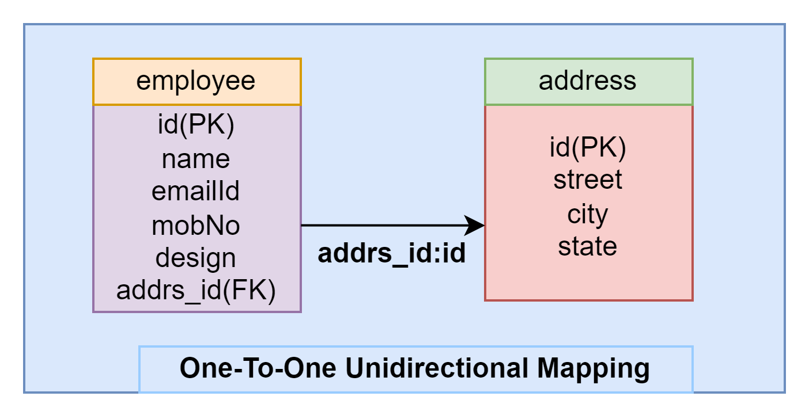
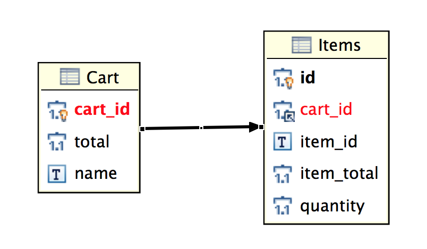
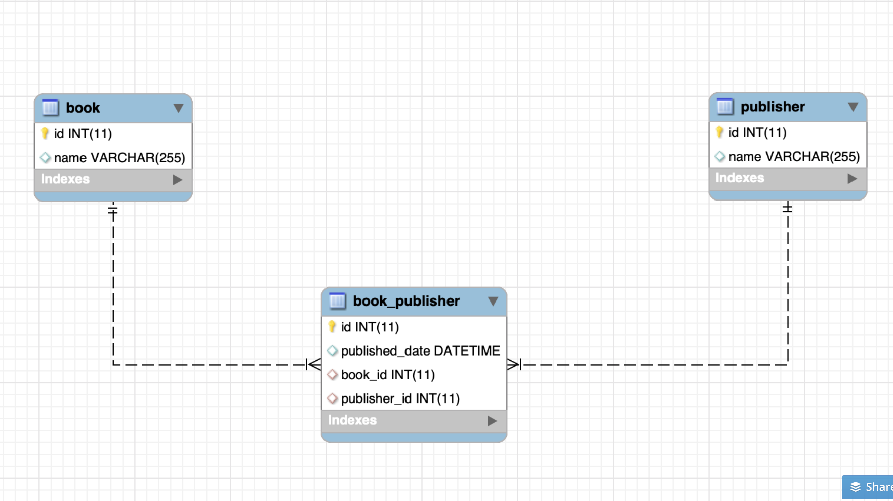

# <h1 align="center"> Hibernate Mapping  </h1>


## 1.Principale annotations de JPA-hibernet 
- __`@Enity`__ : indique que la classe Java correspond à une entité JPA, c’est-à-dire qu’elle sera mappée à une table dans une base de données relationnelle.

- __`@Table(name="[table_name]")`__ : précise explicitement le nom de la table dans la base de données à laquelle l'entité doit être liée. Si cette annotation est omise, JPA utilisera par défaut le nom de la classe.

- __`@Id`__: Indique que l’attribut est la clé primaire de l’entité. Obligatoire pour toute entité JPA.
    - __`@EmbeddedId`__ :  dans le  cas  ou la  clé primaire  est  composite 

- __`@GeneratedValue(strategy = GenerationType.IDENTITY) [(strategy = GenerationType.UUID)]`__ : Spécifie que la clé primaire est générée automatiquement par la base de données (ex : auto-incrément en PostgreSQL/MySQL) depuis hirebenet 6 `UUID` aussi .


- __`@Column(name = "[nom_colonne]", unique=true,legth...)`__
Permet de définir le nom exact de la colonne en base, ainsi que d'autres contraintes comme nullable, length, unique, etc.
les  attribues  souvent  utiliser avec  : 
  - `name` :  ermet de spécifier explicitement le nom de la colonne dans la base de données.
  - `length` permet de définir la taille maximale de la colonne, en particulier pour les champs de type String.
  - `nullable` permet d’indiquer si la colonne peut contenir des valeurs nulles. S’il est défini à false, la colonne sera marquée comme NOT NULL lors de la génération du schéma.
  - `unique` permet de marquer la colonne comme contenant uniquement des valeurs uniques, ce qui génère une contrainte UNIQUE en base de données.
  - `insertable` et `updatable` :Contrôlent si la colonne est incluse lors des insertions ou mises à jour.
    ```java
    @Column(insertable = false, updatable = false)
    private LocalDateTime dateCreation;
    ```

     Utile pour des colonnes gérées par la base (ex : triggers, champs auto-remplis).
  - `precision` et `scale`   :  Utilisés pour les types BigDecimal.
    ```java 
    @Column(precision = 10, scale = 2)
    private BigDecimal salaire;
    ```
    Ici, 12345678.90 est un exemple valide (10 chiffres au total, dont 2 après la virgule).


- __`@Temporal(TemporalType.TIMESTAMP)`__
Spécifie comment une java.util.Date ou java.util.Calendar doit être convertie en base (DATE, TIME, TIMESTAMP).

## Le mapping des associations en ORM
Le mapping des associations définit comment les relations entre les objets en mémoire (les entités) sont traduites en relations entre les tables dans la base de données.

Ces relations peuvent avoir différentes cardinalités (nombre d’éléments liés) : un-à-un, un-à-plusieurs, plusieurs-à-un ou plusieurs-à-plusieurs.

De plus, une association peut être `unidirectionnelle`, où une seule entité connaît la relation, ou `bidirectionnelle`, où les deux entités sont conscientes l’une de l’autre et peuvent naviguer dans les deux sens.

## One To One (@OneToOne) 

<p align="center">
    
</p>


C’est une relation qui définit `un lien exclusif entre deux entités`, où chaque instance de la première entité est associée à __`une seule instance de`__ la seconde entité, et __`inversement`__.

Autrement dit, pour chaque objet de la première entité, il existe exactement un objet correspondant dans la seconde entité.
```java
   @Entity
   @Table(name="user")
   public class User{
      @Column("name")
      private String name;  

      @OneToOne()
      @JoinColmn("id", referencedColumnName  = "id") 
      private IpAdress adresse;    
   }
   @Entity
   @Table(name="adress")
  public class  IpAdress {
    private Long id ;
     @Column("domain")
    private Sring domain ; 
     @Column("ip")
    private String ip;
    
    @OneToOne(mappedBy="adresse")
    private User user ;  
  }

  /** //  relation  en  base 
   *  CREATE TABLE User {
   *   name Varchar(300),
   *   id_adrress INT;
   *   REFRENCE user (id) <--- </clé étrangère>
   * }
   * 
   * CREATE  Table Adrress {
   *   id INT, 
   *   domanin VARHAR(30),
   *   ip VARCHAR(30)
   * }
   * 

```
## One To Many (@OneToMany) 

La relation **One To Many** (ou **un à plusieurs**) définit un lien entre une entité et un ensemble d'autres entités.  
Autrement dit, **une seule entité peut être associée à plusieurs instances d'une autre entité**.

Cette relation est généralement utilisée lorsqu'un objet principal possède une collection d'objets liés.

## Many To One (@ManyToOne)
La relation **Many To One** (ou **plusieurs vers un**) définit un lien où **plusieurs entités peuvent être associées à une seule instance d'une autre entité**.

<p align="center">
    
</p>


Autrement dit, **de nombreuses instances d'une entité sont rattachées à une seule instance d'une autre entité**.

C'est souvent le **côté propriétaire** de la relation inverse `@OneToMany`.


```java

   @Entity
   @Table(name="client")
   public class Client {
     @Id
     private Interger id;
     private String name ; 

     @OneToMany(mappedBy ="client")
     List <Order>orders ; 
   }

   @Entity
   @Table(name="order")
   public class Order {
     @Id
     private Interger id;
     private Date date ; 

    @ManyToOne
    @joinColumn("client_id")
     Client  client; 
   }
    

    /** //  relation  en  base 
   *  CREATE TABLE Client {
   *   id  serial
   *   name Varchar(300),
   *   
   *  
   * }
   * 
   * CREATE  Table order {
   *   id INT, 
   *    date Date,
   *   client_id FOREIGN KEY client (id) <-- </clé étrangère>
   * }
```


---

## 🔁 Relation `@ManyToMany`

La relation **Many To Many** (ou **plusieurs à plusieurs**) relie deux entités où **chaque instance de l’une peut être liée à plusieurs instances de l’autre**, et vice versa.

Par exemple, un **étudiant** peut suivre **plusieurs cours**, et un **cours** peut être suivi par **plusieurs étudiants**.

Pour modéliser une relation `@ManyToMany`, il faut généralement utiliser une **table de jointure** entre les deux entités.  
JPA permet de définir cette relation avec l’annotation `@ManyToMany` et éventuellement `@JoinTable` pour personnaliser la table intermédiaire.

<p align="center">
    
</p>


---

### 🧱 Exemple concret : `Student` et `Course`

#### Entité `Student.java`

```java
@Entity
public class Student {

    @Id
    @GeneratedValue(strategy = GenerationType.IDENTITY)
    private Long id;

    private String name;

    @ManyToMany
    @JoinTable(
        name = "student_course",
        joinColumns = @JoinColumn(name = "student_id"),
        inverseJoinColumns = @JoinColumn(name = "course_id")
    )
    private List<Course> courses;

    // getters, setters
}
```
Entité Course.java
```java
@Entity
public class Course {

    @Id
    @GeneratedValue(strategy = GenerationType.IDENTITY)
    private Long id;

    private String title;

    @ManyToMany(mappedBy = "courses")
    private List<Student> students;

    // getters, setters
}
```


---

### ✅ Représentation dans JPA


```sql
        -- Table des médecins
                CREATE TABLE IF NOT EXISTS medecin (
                    id SERIAL PRIMARY KEY,
                    firstname VARCHAR(100) NOT NULL,
                );

                -- Table des patients
                CREATE TABLE IF NOT EXISTS patient (
                    id SERIAL PRIMARY KEY,
                    firstname VARCHAR(100) NOT NULL,
                    lastname VARCHAR(100) NOT NULL,
                    email VARCHAR(300),
                    UNIQUE(email)
                );    

                -- Table de consultation (table de jointure)
                CREATE TABLE IF NOT EXISTS consultation (
                    id SERIAL PRIMARY KEY,
                    date_consultation TIMESTAMP NOT NULL,

                    medecin_id INT NOT NULL,
                    patient_id INT NOT NULL,
                    rendez_vous_id INT NOT NULL,

                    FOREIGN KEY (medecin_id) REFERENCES medecin(id),
                    FOREIGN KEY (patient_id) REFERENCES patient(id),
                    FOREIGN KEY (rendez_vous_id) REFERENCES rendez_vous(id)
                );
        
```
 Dans cette  exemple chaque `medecin` ou `patient` peuvent  avoir  __plusireus__ `consultations` mais  une `consultation` il devrait etre attribue à  un seule `medecin`  et `patient` donc 

- __class Medecin ou Patient__
    ```java
                public  class Medecin{
                    @OneToMany(mappedby="patient") // ça se lit One Medcin To Many Consultation
                    private List<Consultation>
                }
    ```
    - `mappedby="patient"`:  indique l’attribut propriétaire de la relation dans l’autre entité.

- __class Consultation__        
        
    ```java
            public  class Consultation{
                @ManyToOne // ça se lit many consultation to One Medcin
                private  Medecin medecin; 

                // ça se lit many consultation to One patient
                @JoinColumn(name = "medecin_id") : //définit la colonne de jointure (clé étrangère) dans la table
                private Patient patient;
            }
    ```   
   - `@JoinColumn(name = "medecin_id")` : définit la colonne de jointure (clé étrangère) dans la table consultation.      

## Fetch des Données dans une Relation de Mapping

Dans une relation de mapping entre entités (par exemple en JPA/Hibernate), il existe deux façons principales de charger les données associées : **Fetch Lazy** et **Fetch Eager**.

### 🔄 Fetch Lazy

- Le chargement est **paresseux** : les données de l'entité jointe **ne sont pas récupérées immédiatement** lors de la première requête.
- Elles ne sont chargées **que lorsqu’on y accède explicitement** dans le code, ce qui déclenche une seconde requête SQL.
- Cela permet d'**éviter le chargement inutile de données**, surtout dans le cas de relations volumineuses.

> Exemple :  
> Une entité `Article` avec une relation `@OneToMany` vers `Commentaire`.  
> Si la relation est en `FetchType.LAZY`, les commentaires ne seront chargés que lorsque tu accèderas à `article.getCommentaires()`.

### ⚡ Fetch Eager

- Le chargement est **immédiat** : les données de l'entité jointe sont **automatiquement récupérées** en même temps que l'entité principale.
- Cela signifie qu'**une seule requête** avec jointure est souvent utilisée pour tout charger.
- Utile quand les données associées sont **toujours nécessaires**.

> Exemple :  
> Une entité `Utilisateur` avec un profil (`@OneToOne`) en `FetchType.EAGER` : le profil est automatiquement chargé dès qu’on récupère l’utilisateur.

---

### 💡 Bonnes pratiques

- Utiliser **`FetchType.LAZY` par défaut** pour éviter de charger trop de données inutilement.
- Utiliser **`FetchType.EAGER`** uniquement si les données liées sont **systématiquement nécessaires**.

---


## Cascade dans une Relation de Mapping

Le mot-clé `cascade` en JPA permet de propager automatiquement certaines opérations (comme `persist`, `merge`, `remove`, etc.) d’une entité **parent** vers ses entités **associées**.

Cela évite d’avoir à gérer manuellement les opérations sur les entités enfants lorsqu'on manipule l’entité principale.

### 🔧 Principaux types de cascade

Voici les principales options de cascade que tu peux utiliser avec l’annotation `@OneToOne`, `@OneToMany`, `@ManyToOne` ou `@ManyToMany`.

#### 🔹 `CascadeType.PERSIST`
- Lorsque tu fais `entityManager.persist(parent)`, les entités associées (enfant) sont également persistées automatiquement.

#### 🔹 `CascadeType.MERGE`
- Lorsque tu fais `entityManager.merge(parent)`, les entités associées sont également mises à jour.

#### 🔹 `CascadeType.REMOVE`
- Lorsque tu fais `entityManager.remove(parent)`, les entités associées sont **aussi supprimées**.

#### 🔹 `CascadeType.REFRESH`
- Rafraîchit les entités associées depuis la base de données.

#### 🔹 `CascadeType.DETACH`
- Détache aussi les entités associées du contexte de persistance.

#### 🔹 `CascadeType.ALL`
- Applique **tous** les types de cascade mentionnés ci-dessus.

---

### 📌 Exemple

```java
@Entity
public class Commande {
    
    @OneToMany(mappedBy = "commande", cascade = CascadeType.ALL)
    private List<LigneCommande> lignes;

    // ...
}
```


---
### mapping  types  SQL-Hibrenet 
- __`Primitive Types`__ :  
    | **Mapping Type** | **Type Java**                    | **Type SQL (ANSI)**        |
    | ---------------- | -------------------------------- | -------------------------- |
    | `integer`        | `int` ou `java.lang.Integer`     | `INTEGER`                  |
    | `long`           | `long` ou `java.lang.Long`       | `BIGINT`                   |
    | `short`          | `short` ou `java.lang.Short`     | `SMALLINT`                 |
    | `float`          | `float` ou `java.lang.Float`     | `FLOAT`                    |
    | `double`         | `double` ou `java.lang.Double`   | `DOUBLE`                   |
    | `big_decimal`    | `java.math.BigDecimal`           | `NUMERIC`                  |
    | `character`      | `java.lang.String`               | `CHAR(1)`                  |
    | `string`         | `java.lang.String`               | `VARCHAR`                  |
    | `byte`           | `byte` ou `java.lang.Byte`       | `TINYINT`                  |
    | `boolean`        | `boolean` ou `java.lang.Boolean` | `BIT`                      |
    | `yes/no`         | `boolean` ou `java.lang.Boolean` | `CHAR(1)` (`'Y'` ou `'N'`) |
    | `true/false`     | `boolean` ou `java.lang.Boolean` | `CHAR(1)` (`'T'` ou `'F'`) |

- __`Date and Time Types`__: 

    | **Mapping Type** | **Type Java**                            | **Type SQL (ANSI)** |
    | ---------------- | ---------------------------------------- | ------------------- |
    | `date`           | `java.util.Date` ou `java.sql.Date`      | `DATE`              |
    | `time`           | `java.util.Date` ou `java.sql.Time`      | `TIME`              |
    | `timestamp`      | `java.util.Date` ou `java.sql.Timestamp` | `TIMESTAMP`         |
    | `calendar`       | `java.util.Calendar`                     | `TIMESTAMP`         |
    | `calendar_date`  | `java.util.Calendar`                     | `DATE`              |

- __`Binary and Large Object Types`__ : 

    | **Mapping Type** | **Type Java**                                           | **Type SQL (ANSI)**     |
    | ---------------- | ------------------------------------------------------- | ----------------------- |
    | `binary`         | `byte[]`                                                | `VARBINARY` (ou `BLOB`) |
    | `text`           | `java.lang.String`                                      | `CLOB`                  |
    | `serializable`   | Toute classe Java qui implémente `java.io.Serializable` | `VARBINARY` (ou `BLOB`) |
    | `clob`           | `java.sql.Clob`                                         | `CLOB`                  |
    | `blob`           | `java.sql.Blob`                                         | `BLOB`                  |
    


---

## 2.  Mapping via un fichier XML
Pour effectuer le mapping objet-relationnel avec Hibernate, on utilise généralement les annotations `JPA/Hibernate` directement dans les classes Java.
Cependant, il est également possible de configurer Hibernate à l’aide de fichiers `XML` de mapping.

Dans ce cas, le fichier de configuration Hibernate (comme `hibernate.cfg.xml`) va référencer un fichier XML de mapping spécifique à chaque classe.

📌 Par convention, ces fichiers portent le nom : `NomDeClasse.hbm.xml.`
 ```xml
 <!-- User.hbm.xml -->
<!DOCTYPE hibernate-mapping PUBLIC 
<?xml version = "1.0" encoding = "utf-8"?>
<!DOCTYPE hibernate-mapping PUBLIC 
"-//Hibernate/Hibernate Mapping DTD//EN"
"http://www.hibernate.org/dtd/hibernate-mapping-3.0.dtd"> 

<hibernate-mapping>
   <class name = "Employee" table = "EMPLOYEE">
      
      <meta attribute = "class-description">
         This class contains the employee detail. 
      </meta>
      
      <id name = "id" type = "int" column = "id">
         <generator class="native"/>
      </id>
      
      <property name = "firstName" column = "first_name" type = "string"/>
      <property name = "lastName" column = "last_name" type = "string"/>
      <property name = "salary" column = "salary" type = "int"/>
      
   </class>
</hibernate-mapping>

 ```

 🛠️ Déclarer le mapping dans la configuration Hibernate
 ```xml
 <hibernate-configuration>
    <session-factory>
        <!-- ... tes paramètres JDBC ... -->

        <!-- Déclaration du mapping XML -->
        <mapping resource="com/example/User.hbm.xml"/>
    </session-factory>
</hibernate-configuration>
 ```