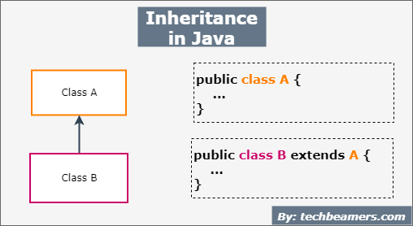

# Héritage (inheritance)

<p align="center">
  
</p>
  
est une relation entre deux classes qui permet à une classe de réutiliser les caractéristiques d’une autre classe.

  - __Redéfinir (Override)__ en programmation orientée objet signifie réécrire une méthode héritée d'une classe parente dans une classe fille, avec exactement la même signature (même nom, même type et nombre de paramètres), mais avec un corps différent (comportement modifié).

  - __surcharge (enoverloading)__ consiste à définir plusieurs méthodes avec le même nom dans une même classe, mais avec des signatures différentes (nombre ou types de paramètres différents).

✅ Résumé :
Terme	Nom identique ?	Signature identique ?	Classe ?	Objectif
Override (Redéfinition)	✅ Oui	✅ Oui	Parent → Enfant	Modifier le comportement
Overload (Surcharge)	✅ Oui	❌ Non	Même classe	Proposer plusieurs variantes

## Polymorphisme
- Possibilité de manipuler des objets sans
connaître leur type spécifique en utilisant
des méthodes polymorphes.

  ➡️ Cela signifie que tu peux écrire du code générique qui fonctionne avec différents types d'objets issus d'une même hiérarchie de classes, sans savoir précisément de quelle sous-classe il s'agit.
 
  ```java
  void makeAnimalSound(Animal animal) {
    animal.makeSound(); // exécute la bonne version selon l'objet réel
  } 
  ```


-  Possibilité d’affecter un objet d’une sousclasse à une variable de la superclasse.

    ➡️ C'est un principe appelé substitution (ou upcasting). Une variable de type superclasse peut référencer un objet d'une sous-classe.
    ```java
         Animal a = new Cat(); // OK : Cat est un Animal
         a.makeSound(); // Affiche "Meow"
    ```
   Dans l'expression Animal a = new Cat(); :

  
    ✅ Le type statique de a est : Animal


    ✅  Le type dynamique (ou réel) de a est : Cat


    Lors de la compilation, le compilateur sait que la variable a est de type Animal (donc une référence de type Animal), mais il ne sait pas exactement quel est le type réel de l'objet auquel a fait référence (dans ton cas, un objet Cat). C'est pour ça que le compilateur permet d'assigner un objet Cat à une variable de type Animal : Cat est une sous-classe de Animal.

    Lors de l'exécution, le moteur Java regarde le type réel de l'objet auquel la variable fait référence. Dans ce cas, c'est un objet de type Cat. Même si la référence est de type Animal, Java appelle la méthode makeSound() définie dans la classe Cat, et non celle de Animal. Cela fonctionne parce que Java utilise la liaison tardive pour résoudre l'appel de méthode au moment de l'exécution, en se basant sur le type réel de l'objet, et non sur le type de la variable.
    
    makeSound() de Animal n'existe pas dans la mémoire pour objet a 

## classes abstraites 
- Une classe abstraite est une classe qu’on ne
pourra pas instancier.
- On la déclare avec le mot clé abstract.
- Une classe abstraite pourra contenir certaines méthodes non implémentées, on parle de méthodes abstraites.
- Si on déclare une méthode abstraite , la classe
doit également être abstraite.


__Les classes abstraites__ sont utiles pour :

- __Avantages de l'héritage__ : Elles permettent de profiter des avantages de l'héritage, comme le partage de code et l'encapsulation, en fournissant une structure de base pour les sous-classes.

- __Encapsulation de comportements communs__ : Une classe abstraite permet de définir des comportements communs que plusieurs classes peuvent partager. Ces comportements sont souvent abstraits et doivent être implémentés par les sous-classes. la raison pour la quelle , une classe abstraite ne peut pas être instanciée directement, car elle ne représente pas un objet concret.

    _Par exemple_, dans le contexte d'un jeu d'animaux, on peut présenter des classes comme `Cat`, `Dog`, etc., qui représentent des entités réelles. Cependant, ces dernières sont susceptibles de partager plusieurs propriétés (âge, nom, etc.) ou fonctionnalités comme `courir()`, `manger()`. L'idée idéale serait de représenter ces entités dans une classe abstraite `Animal`, qui ne peut pas être instanciée, donc il n'est pas possible d'avoir une entité de type Animal (car cela n'existe pas dans ce contexte). Ensuite, des sous-classes pourraient hériter de cette classe abstraite.

    _NB_: L'exemple décrit n'est pas toujours valable, une classe abstraite peut être définie selon le contexte. Par exemple, dans un autre contexte, __Animal __aurait pu être définie comme une classe concrète.

## Interfaces 
 _Une interface_ en Java, est un contrat qui définit un ensemble de méthodes (généralement abstraites) que les classes doivent implémenter.

 - Une interface peut être considérée comme une
classe 100% abstraite.
- Une interface décrit une fonctionnalité sous
forme d’une liste de méthodes mais ne fournit
aucune implémentation de ces méthodes
- Une interface ne peut contenir de variable
d’instance.
- Les seuls attributs autorisés sont les
constantes déclarées static et final.
- Une interface ne peut être instanciée
- Toutes les méthodes d’une interface sont implicitement publiques.
- Une interface peut étendre plusieurs interfaces.
- A partir de __Java 8__, on peut ajouter deux éléments supplémentaires dans une interface:
  - des méthodes statiques
  - des méthodes par défaut qui sont des méthodes concrètes.

__Utilité des interfaces__: 
- Les interfaces sont utilisées pour représenter des propriétés transverses de classes.
  - Exemple : Possibilité de définir une relation   d’ordre sur des objets quelque soit leur type
  - Interface Comparable < T >
  - Exemple : Dans la classe java.util.Arrays :public static void sort (Object[] a) trie les éléments du tableau passé en paramètre à condition que les éléments soient munis d’un ordre naturel, i.e. implémentent l’interface Comparable.
  - permettent aussi de faire le couplage faible entre différents objects 


__NB : Différence entre classes abstraites et interfaces, et leur utilisation__ 

  Bien qu’elles partagent plusieurs points communs, la différence principale dans leur utilisation réside dans le fait qu’une _interface_ représente un contrat que des classes doivent obligatoirement respecter. Ces classes peuvent ne pas avoir de lien d’héritage entre elles (ex : Serializable, Comparable, etc.). Grâce aux _interfaces_, toutes les classes qui les implémentent sont contraintes de respecter une API commune (les méthodes déclarées), ce qui permet d’utiliser ces classes sans connaître leur implémentation exacte.

  Les _interfaces_ permettent également d’implémenter plusieurs comportements (on parle alors de forme de multi-héritage, que les classes ne peuvent pas faire via les classes abstraites).

  En revanche, les _classes abstraites_ servent à décrire un comportement commun dans un contexte bien défini. Elles permettent de factoriser du code et de le faire hériter à toutes les classes qui en dérivent. (Voir la section Classes abstraites pour plus de détails.)
 [Lire la section sur les Classes abstraites](#classes-abstraites).

Une  __`interface`__ peut etendre une ou  plusieurs autre interface 
``` java 
    public interface A extends B,C...ect{} //  héritage  multiple 
``` 

## une class implement deux interface  avec  la meme signature methode
### 🔹 Cas 1 : Deux interfaces définissent la même méthode abstraite
```java
   interface A {
    void parler();
   }

    interface B {
        void parler();
    }

    class C implements A, B {
        public void parler() {
            System.out.println("C parle !");
        }
    }
```
✅ Pas de conflit ici : la classe C doit juste implémenter la méthode parler(). Java ne se plaint pas car il s'agit de simples contrats.

### 🔸 Cas 2 : Deux interfaces définissent la même méthode avec default

Là, les deux interfaces fournissent une implémentation, et Java ne sait pas laquelle choisir.
```java 
      interface A {
          default void parler() {
              System.out.println("A parle");
          }
      }

      interface B {
          default void parler() {
              System.out.println("B parle");
          }
      }

      class C implements A, B {
          // ❗ Java oblige C à résoudre le conflit
          public void parler() {
              A.super.parler(); // ou B.super.parler()
          }
      }
```
✅ Solution :
Tu dois redéfinir la méthode dans la classe et choisir quelle version appeler (ou en écrire une nouvelle).

❗ Non, les `méthodes static` dans les interfaces ne posent pas de conflit comme les méthodes default, car elles ne sont pas héritées par les classes qui implémentent l’interface.


__`⚠️ Règles générales de résolution dans Java :`__

- Si une seule interface fournit une méthode default, elle est utilisée.

- Si deux interfaces fournissent une méthode default, tu dois overrider la méthode.

- Si une classe parente (superclasse) fournit une méthode (même abstract), elle a priorité sur les interfaces.


si une classe parente (comme Animal) définit une méthode, alors c'est toujours celle-ci qui est utilisée, même si les interfaces implémentées (Liveable, BreathAble) fournissent aussi une méthode default avec la même signature.la priorité est claire c'est la méthode dans la  class Animal qui  est proiritére aux defaults methode dans les interfaces 
__Classe > Interface (default) > Interface (abstract)__


## casts
 _En Java_, il existe deux types principaux de cast (ou transtypage) :

 - ✅ 1. Le __cast primitif__ (ou cast de types primitifs):

    C’est lorsqu’on convertit des types de données primitifs entre eux (par exemple int, float, double, char, etc.).

    - Cast implicite (widening / promotion) ⚠️ : Conversion automatique d’un type plus petit vers un type plus grand, car il n’y a pas de perte de données possible.
    ```java
       int x = 10;
       double y = x; //cast implicite : int → double
    ```
    - Cast explicite (narrowing)
Conversion manuelle d’un type plus grand vers un type plus petit, car cela peut entraîner une perte de données.
   ```java
      double a = 9.8;
      int b = (int) a; // cast explicite : double → int
    ```

 - ✅ 1.  2. __Le cast objet__ (ou cast de types objets):

   C’est lorsqu’on convertit une référence d’objet d’un type vers un autre dans une hiérarchie de classes.

    - _Upcasting_ (cast vers la superclasse): Conversion implicite d’un objet d’une sous-classe vers une superclasse.

    ```java
      Cat cat = new Cat();
      Animal a = cat;  // upcasting implicite
    ```
    - _Downcasting_ (cast vers la sous-classe) : Conversion explicite d’un objet de type superclasse vers une sous-classe. ⚠️ Ce cast doit être fait manuellement et avec prudence car pour le  copilateur a est de type _Animal_.
   ```java
    Animal a = new Cat();
    Cat c = (Cat) a;  // downcasting explicite
    ```

   _NB :_ 
   ```java
   Animal a = new Animal(); 
    Cat c = (Cat) a;  // ✅ Compile, ❌ Runtime: ClassCastException
   ```   
     le caste décrit dans  dans exemple au-dessus  est  impossible mais il provoque pas  __d’erreur de compilation__
    
     ✅ Le code compile correctement car le compilateur voit que Cat hérite de Animal, donc le cast est syntaxiquement valide.

     ❌ Mais à l'exécution, tu obtiendras une ClassCastException, car l’objet réel pointé par a est un Animal, pas un Cat.

## important
si  une `class A` extends une  `class B` 

dans le constructeur de  la class  B le super() devrait etre applé (implicitement  si  y'a pas de paramette ) et explicitement  sinon 
