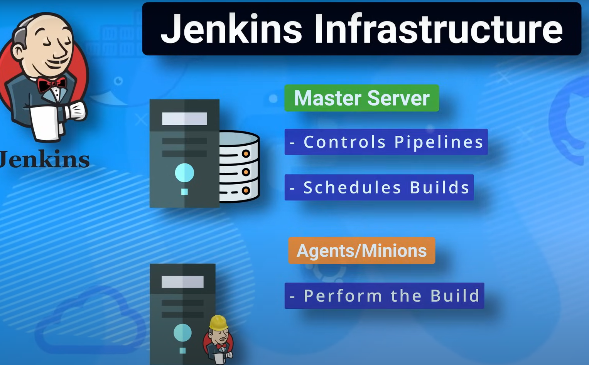

<h1 align="center">jenkins</h1>

Jenkins est un outil open-source  __d’intégration continue (CI)__ et de  __déploiement continu (CD)__ écrit en Java. Il est largement utilisé dans le développement logiciel pour automatiser
 telque 
1. Automatiser le build (la compilation)
2. Lancer les tests automatiquement
3. Déployer l’application automatiquement
4. Intégrer des modifications de code fréquemment
5. Surveiller les changements dans un dépôt Git (ou autre)


## installation  et utilisation 
Jenkins peut être installé directement sur une machine (Linux, Windows, macOS), ou utilisé plus facilement via Docker, ce qui est recommandé pour un déploiement rapide et isolé.
```bash 
docker run -d --name jenkins -p 8080:8080 -p 50000:50000  -v jenkins_home:/var/jenkins_home jenkins/jenkins:lts


-p 8010:8080 : L’interface Web de Jenkins sera accessible à l’adresse http://localhost:8010.
-p 5040:50000 : Port utilisé pour la communication avec les agents Jenkins (JNLP).
-v jenkins_home:/var/jenkins_home : Volume Docker pour la persistance des données Jenkins.
```
Chaque job Jenkins possède son propre espace de travail (workspace),  dans /var/jenkins_home


## infrastrucre de jenkins

<p align="center">
    
</p>

L’architecture de ``Jenkins`` peut varier selon les besoins, mais elle repose généralement sur une structure maître/agents :

1. 🧠 Jenkins Master (Contrôleur) Le serveur principal qui :
    - Gère l'interface web
    - Planifie l'exécution des jobs
    - Attribue les tâches aux agents
    - Gère la configuration, les plugins, les utilisateurs, etc. 

    Répertoire principal : /var/jenkins_home Contient :
    - La configuration des jobs
    - Les plugins
    - Les logs
    - Les utilisateurs
    - Les workspaces


2. 🖥️ Jenkins Agents (ou Slaves)

    Machines (physiques ou virtuelles) auxquelles le contrôleur peut déléguer l'exécution des tâches.
    - Utiles pour répartir la charge
    - Peuvent être spécialisés (ex. : un agent pour Java, un autre pour Node.js, etc.)
    - Communiquent avec le contrôleur via SSH, JNLP, ou Docke


3. 🔌 Plugins Jenkins

    Jenkins est hautement extensible grâce à plus de 1 800 plugins permettant :
    1. L’intégration avec Git, Docker, Kubernetes, Slack, Jira, etc.
    2. L’ajout de types de jobs spécifiques (Pipeline, Maven, etc.)
    3. La gestion de la sécurité, des credentials, des notifications, etc.


4. 🧱 Pipeline Jenkins (Jenkinsfile)

    Un fichier texte écrit en ``Groovy`` qui décrit les étapes (stages) d’un processus CI/CD.


## Différents types de job jenkins

## 📌 Différents types de jobs Jenkins

### 1. 🧱 Freestyle Job
C’est le type de job **classique** dans Jenkins.  
Il offre une interface graphique simple pour configurer les étapes (build, test, déploiement).

**Caractéristiques :**
- Configuration via l’interface graphique.
- Simple à mettre en place mais peu flexible.
- Pas de gestion du pipeline sous forme de code.

---

### 2. 🔁 Pipeline Job (Scripted ou Declarative)
Un job **Pipeline** permet de décrire l’ensemble du workflow de CI/CD **sous forme de code**, souvent dans un fichier `Jenkinsfile`.

**Caractéristiques :**
- Supporte des étapes complexes (conditions, parallélisme, etc.).
- Code versionné avec le projet.
- Deux syntaxes possibles :
  - **Declarative** (recommandée)
  - **Scripted** (plus ancienne et flexible)

---

### 3. 🌿 Multibranch Pipeline
Extension du **Pipeline** qui permet de créer automatiquement des jobs pour **chaque branche** d’un dépôt Git contenant un `Jenkinsfile`.

**Caractéristiques :**
- Détection automatique des branches.
- Chaque branche possède son pipeline dédié.
- Idéal pour les projets avec plusieurs environnements (dev, staging, prod).

---

### 4. 🏗️ Pipeline Multiconfiguration (Matrix Job)
Permet d’exécuter un job sur **plusieurs combinaisons** d’axes (versions de Java, systèmes d’exploitation, bases de données, etc.).

**Caractéristiques :**
- Idéal pour les **tests croisés**.
- Possibilité de lancer les builds en parallèle.
- Moins utilisé depuis l’apparition des pipelines parallélisés.


⚙️ Récapitulatif des différences

| Type de Job          | Code / Scripté      | Auto-détection des branches | Complexité       | Cas d’usage typique  |
| -------------------- | ------------------- | --------------------------- | ---------------- | -------------------- |
| Freestyle            | Non                 | Non                         | Faible           | Tâches simples       |
| Pipeline             | Oui (`Jenkinsfile`) | Non                         | Moyenne à élevée | CI/CD scripté        |
| Multibranch Pipeline | Oui                 | Oui                         | Élevée           | CI/CD multi-branches |
| Matrix (Multiconfig) | Optionnel           | Non                         | Moyenne          | Tests croisés        |


## Agent
Dans Jenkins, un `agent` (aussi appelé ``node``) est une machine ou un conteneur qui exécute des jobs Jenkins à la place du master.

### 1. Master / Controller Jenkins
- Serveur principal de Jenkins
- Orchestre les jobs, gère l’interface web et les plugins.
- Peut exécuter des builds lui-même, mais ce n’est pas recommandé pour la production.

### 2. Agent
- Machine ou conteneur qui exécute réellement les jobs.
- Reçoit des instructions du master pour :
    * Compiler le code
    * Exécuter des tests
    * Déployer des applications
- Peut être configuré pour :
    * Exécuter un ou plusieurs jobs en parallèle via # of executors
    * Avoir des labels pour cibler certains jobs (ex : java, docker, linux)

###  3. Types d’agents
- ``Static agents`` : machines fixes enregistrées dans Jenkins.
- ``Dynamic agents ``: conteneurs ou machines provisionnés à la volée (via Kubernetes, Docker, AWS EC2, etc.).

### 4. Exemple concret
Supposons que tu as deux jobs :
- Job A -> besoin de Maven
- Job B -> besoin de Node.js

tu peux créer 
* Agent `maven-agent` avec Maven installé
* Agent `node-agent` avec Node.js installé


## Cloud dans Jenkins

Dans **Jenkins**, le terme **Cloud** désigne une configuration qui permet à Jenkins de **déléguer l’exécution de jobs à des agents dynamiques**, créés et détruits à la demande via une infrastructure externe (Docker, Kubernetes, AWS, etc.).

## Agent statique par défaut dans Jenkins

## 🔹 Définition
- L’**agent statique par défaut** est le **"Built-In Node"** (anciennement appelé "master").  
- C’est la **machine où Jenkins est installé**.  
- Il est **toujours présent** et ne change pas (contrairement aux agents dynamiques).

---

## 🔹 Fonctionnement
- Par défaut, si aucun autre agent n’est configuré, les jobs s’exécutent sur cet agent.  
- Il combine deux rôles :
  - **Contrôleur Jenkins** → gère l’UI, les jobs, les plugins, la planification.  
  - **Agent d’exécution** → exécute directement les jobs sur la même machine.

---

## 🔹 Limites
- Risque de surcharge si tous les jobs tournent dessus.  
- Bonne pratique : **désactiver l’exécution de jobs sur le contrôleur** et utiliser des agents dédiés (statiques ou dynamiques).

---

## 🔹 Résumé
👉 **Agent statique par défaut = le contrôleur Jenkins (la machine hôte).**  
Toujours présent, contrairement aux agents "Cloud" qui sont créés et détruits à la demande.


---

## Pourquoi utiliser le Cloud dans Jenkins ?
- Ne pas dépendre uniquement d’agents statiques (toujours actifs).  
- **Provisionner dynamiquement** des agents uniquement quand un job en a besoin.  
- Réduire les coûts et mieux gérer les ressources.  
- Faciliter le **scaling automatique**.

---


## Exemples de Clouds disponibles
- **Kubernetes Cloud** → Jenkins déploie des pods dynamiques dans un cluster Kubernetes.  
- **Docker Cloud** → Jenkins démarre des conteneurs Docker pour exécuter les jobs.  
- **Amazon EC2 Cloud** → Jenkins lance des instances EC2 comme agents.  
- **OpenStack Cloud** → Provisionnement de VMs sur OpenStack.  
- **VMware vSphere Cloud** → Création de machines virtuelles.  

---

## Docker Cloud dans Jenkins
Oui ✅, cela signifie que ton **job peut s’exécuter dans un conteneur Docker** au lieu de l’agent directement.

### Fonctionnement :
1. Jenkins est connecté à un démon Docker (local ou distant).  
2. Tu définis une **Docker Agent Template** (image Docker à utiliser).  
3. Lorsqu’un job démarre :
   - Jenkins crée un conteneur basé sur cette image.  
   - Les étapes du pipeline/job s’exécutent dans ce conteneur.  
   - Le conteneur est supprimé après le job.  

---

## Exemple de Pipeline avec Docker
```groovy
pipeline {
    agent {
        docker {
            image 'maven:3.9.6-eclipse-temurin-17'
            args '-v /root/.m2:/root/.m2' // partage du cache Maven local
        }
    }
    stages {
        stage('Build') {
            steps {
                sh 'mvn clean package'
            }
        }
    }
}
```
# 📑 Exemple de Jenkinsfile documenté

Ce fichier décrit un pipeline Jenkins déclaré (Pipeline-as-Code).  
Il est écrit en **Groovy** et doit être placé à la racine du dépôt (nommé `Jenkinsfile`).  

---

## 🔹 Structure générale
Un pipeline Jenkins est composé de :  
- **agent** → définit où s’exécutent les jobs (machine, Docker, Kubernetes, etc.)  
- **options** → règles globales (timeout, conservation des builds, etc.)  
- **environment** → variables d’environnement globales  
- **stages** → étapes principales (build, test, déploiement)  
- **post** → actions à exécuter après le pipeline (succès, échec, nettoyage)

---

## 🔹 Exemple complet

```groovy
pipeline {
    /*
     * Définition de l'agent
     * Ici, on utilise un conteneur Docker comme environnement d'exécution.
     */
    agent {
        docker {
            image 'maven:3.9.6-eclipse-temurin-17' // image Docker utilisée
            args '-v /root/.m2:/root/.m2'        // partage du cache Maven local
        }
    }

    /*
     * Options globales
     */
    options {
        timeout(time: 30, unit: 'MINUTES')       // limite d'exécution
        buildDiscarder(logRotator(numToKeepStr: '10')) // garder seulement 10 builds
    }

    /*
     * Variables d'environnement globales
     */
    environment {
        APP_NAME = "my-app"
        APP_VERSION = "1.0.0"
    }

    /*
     * Définition des étapes (stages)
     */
    stages {

        stage('Checkout') {
            steps {
                echo "📥 Récupération du code source..."
                checkout scm
            }
        }

        stage('Build') {
            steps {
                echo "🔨 Compilation du projet avec Maven"
                sh 'mvn clean package -DskipTests'
            }
        }

        stage('Test') {
            steps {
                echo "🧪 Lancement des tests unitaires"
                sh 'mvn test'
            }
            post {
                always {
                    junit '**/target/surefire-reports/*.xml' // publier les résultats de tests
                }
            }
        }

        stage('Analyse') {
            steps {
                echo "🔎 Analyse du code (SonarQube ou autre)"
                // withSonarQubeEnv('sonar-server') {
                //     sh 'mvn sonar:sonar'
                // }
            }
        }

        stage('Package & Archive') {
            steps {
                echo "📦 Archivage du build"
                archiveArtifacts artifacts: 'target/*.jar', fingerprint: true
            }
        }

        stage('Deploy (staging)') {
            when {
                branch 'develop'
            }
            steps {
                echo "🚀 Déploiement en environnement de staging"
                sh "scp target/${APP_NAME}-${APP_VERSION}.jar user@staging:/apps/"
            }
        }

        stage('Deploy (production)') {
            when {
                branch 'main'
            }
            steps {
                input message: "Confirmer le déploiement en production ?"
                echo "🚀 Déploiement en production"
                sh "scp target/${APP_NAME}-${APP_VERSION}.jar user@prod:/apps/"
            }
        }
    }

    /*
     * Post actions (toujours exécutées en fin de pipeline)
     */
    post {
        success {
            echo "✅ Pipeline terminé avec succès !"
        }
        failure {
            echo "❌ Échec du pipeline."
        }
        always {
            cleanWs() // nettoyage du workspace
        }
    }
}


# Jenkins configuration
## 1. Configuration globale (Manage Jenkins → Configure System)
- #of executors :  nombre de thread à  utiliser en paralèle  autement dit  le  nombre de build à  lancer en paralèle