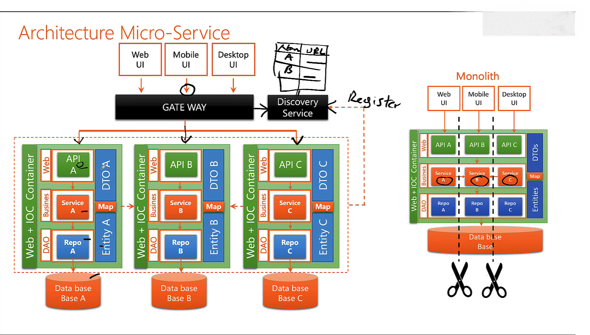
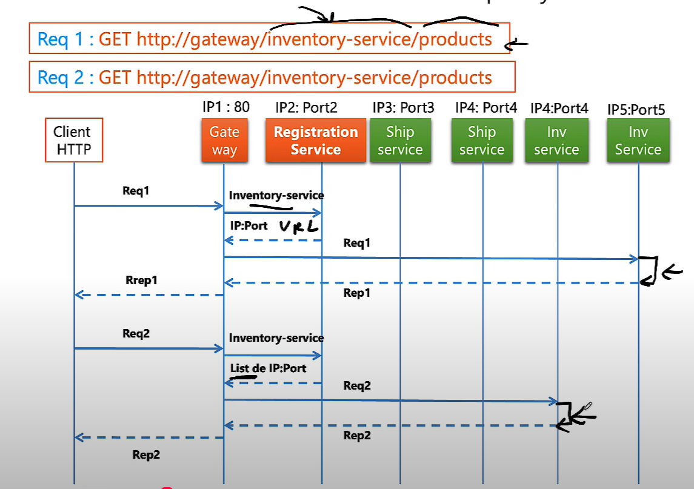

# <h1 align="center"> Micro -Service </h1>

Le **microservice** est une architecture logicielle qui consiste à structurer une application en un ensemble de services indépendants, autonomes et faiblement couplés.  
Chaque service implémente une fonctionnalité métier bien définie, communique avec les autres via des API (souvent HTTP/REST ou des messages asynchrones), et peut être développé, déployé et mis à l’échelle indépendamment.

Cette approche favorise la modularité, la résilience, la scalabilité et l’agilité dans le développement logiciel.

Chaque **microservice** est une petite application isolée, qui possède ses propres entités, services, et logique métier.  
Pour que tous ces services puissent fonctionner ensemble, sous le toit d’une seule application cohérente, nous avons besoin de mettre en place une infrastructure complémentaire.

---

    

# <h1 align="center">Microservices</h1>

Un **microservice** est une petite application autonome, responsable d'une seule fonction métier.  
Chaque microservice dispose de ses propres entités, services, base de données (dans l’idéal), et peut être développé, déployé et mis à jour indépendamment des autres.

Pour que tous ces microservices fonctionnent ensemble, sous l’architecture d’une seule application distribuée, il est nécessaire de mettre en place une infrastructure centrale comprenant :

---

## 1. 🔀 Gateway (API Gateway)

La **Gateway** est un composant technique qui agit comme **point d’entrée unique** pour toutes les requêtes externes (clients, navigateurs, applications mobiles…).

Elle se charge de :
- Recevoir les requêtes des utilisateurs
- Les router automatiquement vers le microservice concerné
- Appliquer des fonctions transversales comme la sécurité, les logs, le filtrage, etc.
- ✅ **Faire du load balancing** : si plusieurs instances d’un même microservice sont disponibles, elle répartit la charge entre elles, assurant ainsi performance et haute disponibilité.

> La Gateway joue donc le rôle d’un **routeur intelligent** combiné à un **répartiteur de charge**.

---

## 2. 📘 Discovery Service (Service Registry)

Le **Discovery Service** est un **annuaire dynamique** dans lequel chaque microservice **s'enregistre automatiquement** avec son nom et son adresse IP ou URL.

Il permet :
- À la Gateway de localiser les microservices à tout moment
- Aux microservices de se découvrir entre eux sans configuration statique

> C’est comparable à une **map dynamique** du type `(nom de service → adresse IP)`.

---

### 🧩 Outils courants dans l’écosystème Spring

| Composant         | Outil recommandé     |
|-------------------|----------------------|
| Gateway           | Spring Cloud Gateway |
| Discovery Service | Eureka (Netflix OSS) |
| Load Balancing    | Spring Cloud LoadBalancer |

---
### 📌 Config Service

Le **Config Service** est un microservice centralisé chargé de **gérer les fichiers de configuration** de l'ensemble des microservices d'une application.

Il permet de :
- Centraliser toutes les configurations dans un seul endroit (par exemple : un dépôt Git)
- Appliquer des configurations **dynamiquement**, sans redémarrer les microservices
- Faciliter la gestion des environnements (dev, test, prod)
- Maintenir la cohérence des paramètres sensibles ou partagés (comme les URL, clés API, ports, etc.)

> Grâce au **refresh dynamique** (via Spring Cloud Config + Actuator), un microservice peut recharger sa configuration **à chaud**, sans être redémarré.

---

## load balancing micro-service

    

