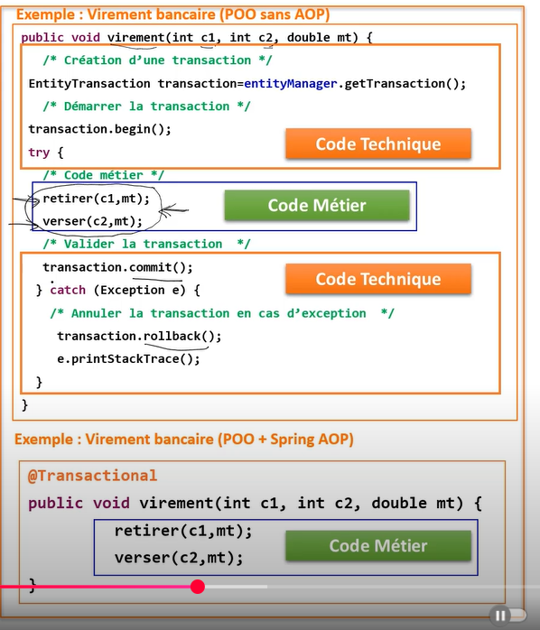
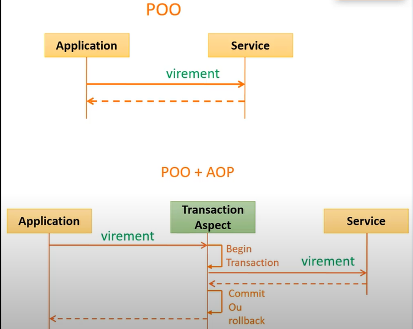
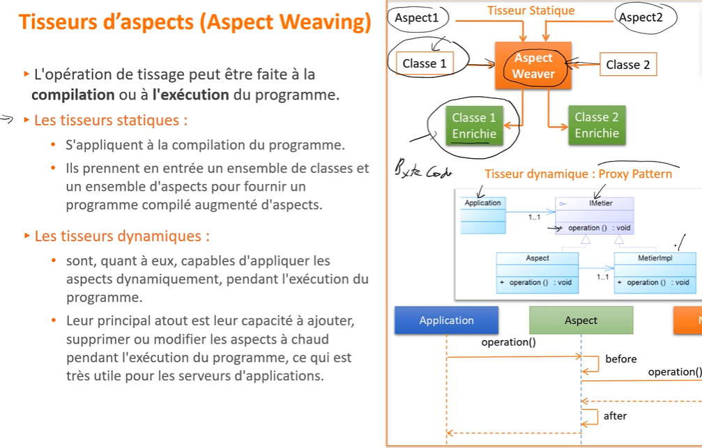
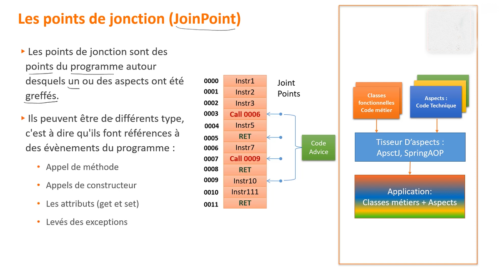
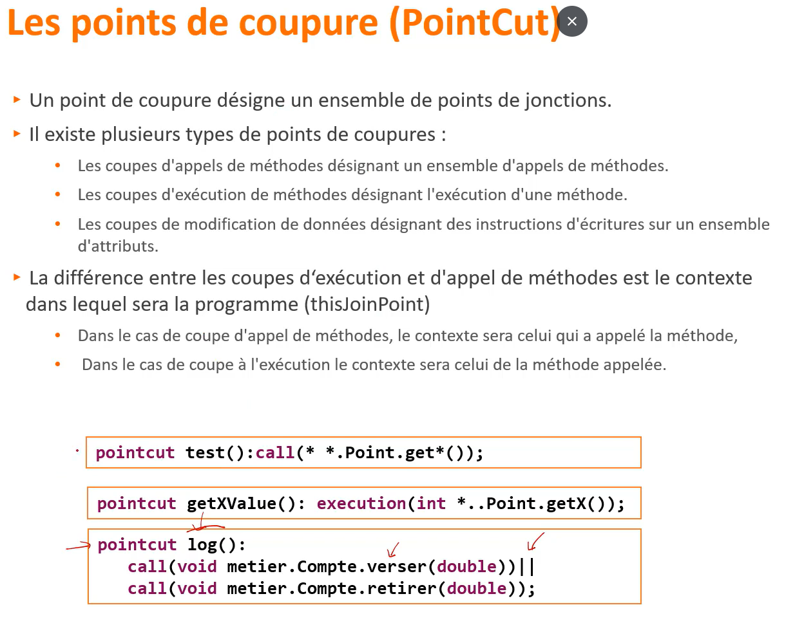
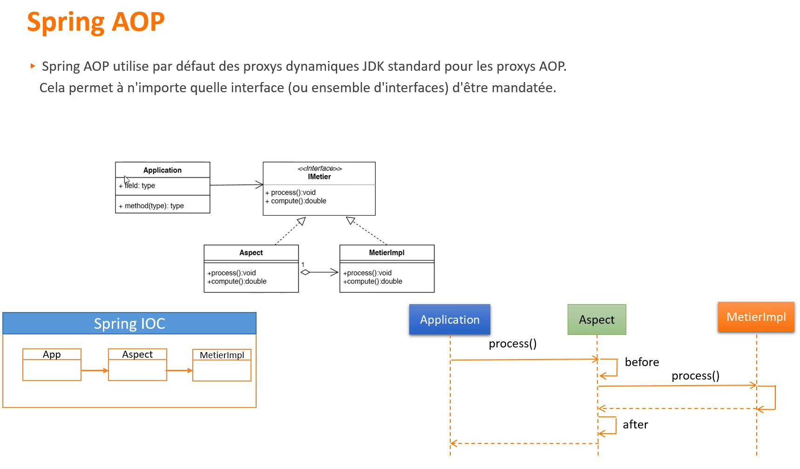

# Spring Aop (Aspect oriented programming)
__`La programmation orientée aspect`__ est un paradigme de programmation qui permet de séparer les __préoccupations transversales__ des __préoccupations métier__, afin de rendre le code plus modulaire, lisible et maintenable.

- Les __`préoccupations transversales`__ (ou __cross-cutting concerns__) regroupent des fonctionnalités techniques comme la journalisation, la gestion des transactions, la sécurité, etc. Ces aspects sont souvent répétitifs et présents dans plusieurs parties de l'application.

- Les __`préoccupations métier`__, quant à elles, constituent le cœur fonctionnel de l'application : ce sont les règles spécifiques à l'activité que l'application implémente. 

La __AOP__ permet de développer ces préoccupations séparément, puis de les réutiliser dans différentes parties du projet. Grâce à des outils appelés __tisseurs d’aspects__ (comme __Spring AOP__ ou __AspectJ__), le code des aspects est combiné automatiquement au code métier au moment de la compilation ou de l'exécution. Cela permet de garder le code métier propre, tout en appliquant les aspects techniques de manière centralisée et non intrusive.

## POO VS POO + AOP

<p align="center">
  
</p>

<p align="center">
  
</p>


## Tisseurs d’aspects (Aspect Weaver)

En __programmation orientée aspect__, un programme est généralement structuré en deux parties distinctes :

- Les __classes métier__, qui contiennent la logique fonctionnelle principale de l’application.

- Les __aspects__, qui encapsulent les préoccupations transversales (techniques), comme la journalisation, la sécurité ou la gestion des transactions.

Le programme  `ne doit pas avoir  connaissances des aspects`  il sont  jamais appellé dans une  class  du programme 
c'est le  but des tisseurs d'aspects  ou  (`aspect  weaver`) ils ont le role de griffer l'ensemble  des aspects sur l'ensembles des classes du  programme 

les tisseurs  d'aspects se différencient sur deux points 
- le langage du programmation utilisé 
- le moment ou  le tissage est réalisé  (compilation , Excuction)

    <p align="center">
    
    </p>

 
## <h2 align="center"> Concepts  de  base de AOP </h2>
- ## __`1. Les points de jonction (JoinPoint):`__ :  
les  points  de jonctions sont des points du  programme autour desquels un ou  des  aspects ont été greffées 
 
  <p align="center">
    
  </p>

- ## __`2. Les points de coupure (): PointCut`__ :
   un point de coupure désigne un ensembe  de points de jonctions   
  <p align="center">
    
    </p>
## Types de Pointcuts (PointCut) en AOP

  En AOP, les pointcuts ciblent des points spécifiques dans l'exécution du programme. Voici les principaux types :

  - **execution()**  
    Cible l'exécution d'une méthode (dans le corps de la méthode).  
    *Supporté par Spring AOP.*

  - **call()**  
    Cible l'appel d'une méthode (l'endroit où la méthode est appelée).  
    *Non supporté par Spring AOP, uniquement AspectJ.*

  - **get() / set()**  
    Cible l'accès ou la modification d'un champ (attribut).

  - **handler()**  
    Cible un bloc `catch` lors de la gestion d'une exception.

  - **initialization() / preinitialization()**  
    Cible la création d'un objet, pendant (initialization) ou juste avant (preinitialization) l’exécution du constructeur.

  - **staticinitialization()**  
    Cible les blocs statiques d'initialisation d’une classe.

  ---

  ### Différence entre execution() et call()

  | Pointcut    | Description                      | Support Spring AOP |
  |-------------|---------------------------------|--------------------|
  | execution() | Exécution de la méthode          | Oui                |
  | call()      | Appel de la méthode              | Non                |


- ## __`3. Wildcard` :__ 
Dans un langage de programmation orienté aspect, il est essentiel de fournir au développeur une structure syntaxique permettant de déclarer des points de coupure (pointcuts).
  - Chaque langage définit sa propre syntaxe pour exprimer ces points de coupure.
  - Les **wildcards** (caractères génériques) permettent de cibler plusieurs méthodes, classes ou signatures à la fois.
  - Elles peuvent être comparées aux expressions régulières, dans le sens où elles permettent de caractériser de manière flexible des portions du programme à intercepter.

Exemple  :
```java
  call (* *..Point.get*(..))
  // * : le  type  de retoure
  // *.: n'import quel package
  // get*() : toutes  les  méthodes qui terminent  par get() 
```

- ## __`4. Les Codes Advices`__

Les blocs **Advices** sont des blocs de code qui exécutent un aspect.  
Les codes Advices caractérisent le comportement de l'aspect.  

Chaque code Advice d'un aspect doit être associé à une coupe (pointcut) pour être exécuté.  
Ils ne seront exécutés que si un événement défini par un point de coupure a été intercepté.  

Un code Advice peut être exécuté selon trois modes :  
- **avant** (before)  
- **après** (after)  
- **autour** (around) d'un point de jonction (join point).


<h2 align="center"> exemple avec Aspectj</h2>

Pour définir un aspect avec AspectJ, il faut un fichier de type `.aj`.
On peut le définir soit par une syntaxe de class, soit par une syntaxe `annotation`.
1. __Syntaxe de class aj__ 
    ```java
            
            public aspect FirstAspect {

              pointcut pc1() : execution(* org.halim.aoptest.App.main(..));
              

              before() : pc1() {
                  System.out.println("---------------------------------------------");
                  System.out.println("Before main from AspectJ syntax");
                  System.out.println("---------------------------------------------");
              }

              after() : pc1() {
                  System.out.println("---------------------------------------------");
                  System.out.println("After main from AspectJ syntax");
                  System.out.println("---------------------------------------------");
              }

                void around() : pc1 () {
                    System.out.println("---------------------------------------------");
                    System.out.println("Before main from AspectJ syntax in  around ");
                    System.out.println("---------------------------------------------");
                    // Execution  de l'operation  du  pointcut
                     proceed();

                    System.out.println("---------------------------------------------");
                    System.out.println("After main from AspectJ syntax in around ");
                    System.out.println("---------------------------------------------");
                }
          }
    
    ```
1. __Syntaxe de annotations avec des  class  java__ 
    ```java
      @Aspect
      public class SecondAspect {

          // Pointcut ciblant toute méthode main() dans un package org.*
          @Pointcut("execution(* org.*.main(..))")
          public void pc1() {}

          // Advice avant l'exécution des méthodes ciblées par pc1
          @Before("pc1()")
          public void applyBeforeMain() {
              System.out.println("---------------------------------------------");
              System.out.println("Before main from AspectJ syntax from SecondAspect class");
              System.out.println("---------------------------------------------");
          }

          @Around("pc1()")
          public void  aroundMain  (ProceedingJoinPoint proceedingJoinPoint) throws Exception{
          System.out.println("---------------------------------------------");
           System.out.println("Aroun main from AspectJ syntax  from FirstAspect.aj  file ");
          
          proceedingJoinPoint.proceed();
          System.out.println("---------------------------------------------");
        
         }

          @Before("execution(* service.OrderService.*(..))")
          public void logBefore(JoinPoint joinPoint) {
                System.out.println("Appel de : " + joinPoint.getSignature());
                joinPoint.getTarget();  //<= return l'object  anglobant du point de jointure (point cut)
            }

          @Before ("pc2() && args(code , montant)")
            public void checkArguement(Long code , double montant) {  // controller  les (obtenir les arguments utilisé  par la methode)
                System.out.println(" La valeur  du code est "+ code  +"montant :"  +montant);

            }
      }
    ```


<h1 align="center"> SpringAOP</h1> 

est un module du framework `Spring` qui permet de gérer la programmation orientée aspect. Elle est utilisée pour séparer les préoccupations transversales (appelées cross-cutting concerns) de la logique métier principale.

`Spring AOP` complète `Spring IoC` pour fournir une solution middleware très performante.

L'approche de Spring AOP diffère de celle de la plupart des autres frameworks AOP comme **AspectJ**. Le but de Spring AOP **n’est pas** de fournir une implémentation complète de toutes les possibilités de l’AOP, mais plutôt de proposer une **intégration étroite entre l’AOP et Spring IoC** afin de résoudre les problèmes courants rencontrés dans les applications d’entreprise.

Spring intègre de manière **transparente** Spring AOP et IoC avec **AspectJ**, ce qui permet à toutes les utilisations de l’AOP d’être prises en compte dans une architecture d'application cohérente, basée sur le framework Spring.

<p align="center">
    
</p>

# Explication des dépendances Spring (avec `spring-aspects`)

## 1. `spring-core`
Le noyau de Spring, fournit les fonctionnalités de base comme l'IoC, DI et des utilitaires essentiels.

## 2. `spring-context`
Fournit un contexte d'application complet basé sur IoC, prend en charge les annotations, le cycle de vie des beans, les événements, etc.

## 3. `spring-beans`
Gère la création, configuration et le cycle de vie des beans Spring.

## 4. `spring-aop`
Module pour la programmation orientée aspect (AOP) dans Spring. Permet la définition d’aspects, pointcuts, advices, et l’interception des méthodes.

## 5. `spring-aspects`
C’est un **module complémentaire** qui intègre l’implémentation complète d’AspectJ dans Spring.  
Cela permet de tirer parti des **fonctionnalités avancées d’AspectJ**, telles que :  
- Le tissage au moment de la compilation ou du chargement (compile-time / load-time weaving).  
- Un support plus riche et puissant des aspects que celui de la simple AOP proxy-based de Spring.  

**En résumé :**  
- `spring-aop` fournit une AOP simple basée sur des proxies dynamiques (runtime).  
- `spring-aspects` permet d’utiliser AspectJ complet (plus puissant, plus flexible) avec Spring.

---

# Résumé rapide

| Dépendance      | Rôle principal                                      |
|-----------------|----------------------------------------------------|
| `spring-core`   | Noyau Spring, IoC, DI, utilitaires                  |
| `spring-context`| Contexte d’application, annotations, gestion beans |
| `spring-beans`  | Gestion création et lifecycle des beans             |
| `spring-aop`    | AOP proxy-based simple et runtime                    |
| `spring-aspects`| Intégration AspectJ complète (compile/load-time weaving) |

---

## Le tissage Spring AOP

Le tissage (weaving) de Spring AOP se fait **à l’exécution**.  

### Pourquoi Spring prend-il en compte les aspects ?

Pour que l’aspect soit pris en compte, il faut que la classe aspect soit **enregistrée dans le conteneur Spring**.  
Cela se fait généralement en ajoutant l’annotation __`@Component`__ (ou une autre annotation stéréotype) sur la `classe aspect`, ce qui permet à Spring de la détecter et de l’utiliser.
àjouter aussi `@EnableAspectJAutoProxy` Cette annotation permet d’activer la prise en charge d’AOP (programmation orientée aspect) basée sur AspectJ dans une application Spring.
```java
@Aspect
@Component
@EnableAspectJAutoProxy
public class LogAspect {
    

    IService service = context.getBean(IService.class);
    service.getClass().getName() // spring return  jdk.proxy3.$Proxy40 car c'est la class proxy qui est appeller  par spring  pour  tisser le  aspect
    
    @Before("execution (* org.halim.aop.service.*(..) )")
    public void  log  ()  {
        System.out.println("this is beofre  proecess  method ");
    }

    // faire des aspects  avec des annotations  
     @Around("@annotation(org.halim.aop.aspects.Log)") // toutes les méthode  posséde annotation @Log vont etre ciblé par  aspect
    public Object  log  (ProceedingJoinPoint proceedingJoinPoint)  throws Throwable {  
         System.out.println("-------------- aspect has  been applied ---------------");  
        return proceed;
    }


   // utiliser  des aspect avec des annotaion avec params 
    @Around(value = "@annotation(securedByAspect)" , argNames = "proceedingJoinPoint, securedByAspect") // attention dans ce cas  on passe la variable pas  objets ⚠️⚠️⚠️⚠️⚠️
    public Object  log  (ProceedingJoinPoint proceedingJoinPoint,  SecuredByAspect securedByAspect)  throws Throwable {  
        var proceed = proceedingJoinPoint.proceed();
        System.out.println("La valeur  de annoattion est : "+ securedByAspect.roles()[0]);
        return proceed;
    }

}
```


---

### Fonctionnement de l’injection avec Aspect

Pour chaque bean Spring, si des aspects s’appliquent à ses méthodes,  
Spring crée un **proxy** autour de cet objet.  

Ce proxy intercepte les appels pour appliquer les aspects,  
puis délègue à l’instance réelle du bean.

---

### Exemple

```java
@Autowired
private IUserService userService; // Spring injecte en réalité un proxy de UserService
```
Ce proxy fonctionne ainsi :
```
userService ---> proxy ---> (applique les aspects) ---> instance réelle de UserService
```

### Cas sans interface
Si la classe ne possède pas d’interface, Spring utilise CGLIB pour créer le proxy,
c’est-à-dire une sous-classe dynamique de la classe concrète. __dans ce cas  la class  en question ne devrait pas etre final car spring  ne pas hérité de cette class dans ce cas__


---

# 🛠️ Compilation et exécution d’un projet Java avec AspectJ

## ✅ Dépendances nécessaires

Pour utiliser AspectJ dans un projet Maven, trois dépendances sont essentielles :

### 1. `aspectj-maven-plugin`
- Plugin Maven qui permet de **compiler** les fichiers `.aj` (syntaxe AspectJ).
- Il assure également le **tissage à la compilation** (injection du code dans les classes Java cibles).

### 2. `aspectjtools`
- Contient les outils nécessaires à la compilation des aspects, notamment le compilateur `ajc`.

### 3. `aspectjrt` (AspectJ Runtime)
- Fournit les classes nécessaires à l'exécution des aspects, telles que `JoinPoint`, `NoAspectBoundException`, etc.

---

## 🚀 Exécution d’un programme avec AspectJ

### 🅰️ Sans plugin Maven (tissage à l’exécution - LTW)

Dans ce mode, le tissage des aspects s'effectue **au moment de l'exécution**, en utilisant l'agent Java `aspectjweaver.jar` :

```bash
java -javaagent:libs/aspectjweaver.jar -cp "target/aoptest-1.0-SNAPSHOT.jar;libs/*" org.halim.aoptest.App
```

## Important 
🌝 Programmation orientée aspect (AOP) : l’aspect doit-il interagir avec le traitement métier ?
Non, un aspect ne doit pas modifier ou influencer directement la logique métier principale.Il agit en périphérie, pour ajouter des comportements transversaux (aussi appelés cross-cutting concerns), tels que :
🔐 Sécurité

-  🩵 Logging

- 💸 Transactions

- ✅ Validation légère

- ⏱ Métriques / performances

- 🔀 Gestion d’erreurs

**⚠️ Exemple de ce qu’il ne faut pas faire**
```java
Around("execution(* service.OrderService.*(..))")
public Object myAspect(ProceedingJoinPoint joinPoint) throws Throwable {
    // ❌ Mauvaise pratique : modifier les arguments métier
    Object[] args = joinPoint.getArgs();
    args[0] = null; // 😱 On casse le traitement métier
    return joinPoint.proceed(args);
}
```
