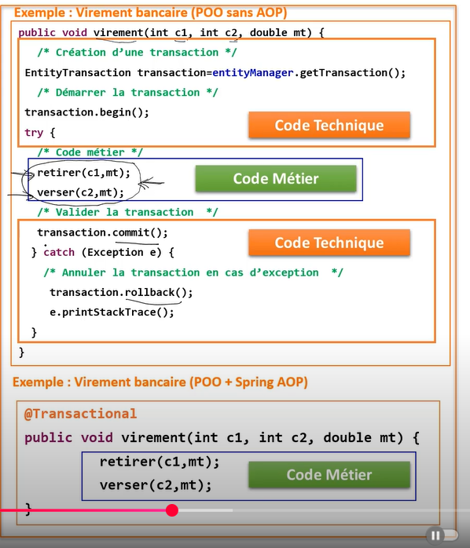
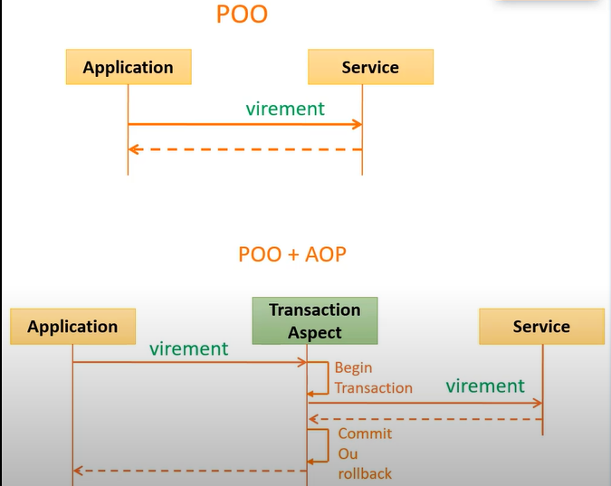
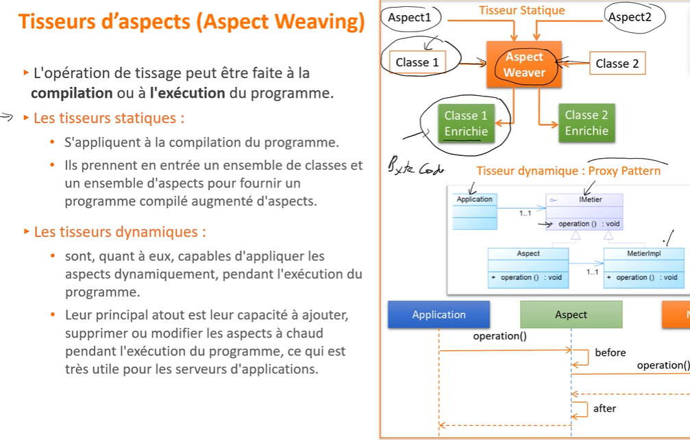

# Spring Aop (Aspect oriented programming)
__`La programmation orientée aspect`__ est un paradigme de programmation qui permet de séparer les __préoccupations transversales__ des __préoccupations métier__, afin de rendre le code plus modulaire, lisible et maintenable.

- Les __`préoccupations transversales`__ (ou __cross-cutting concerns__) regroupent des fonctionnalités techniques comme la journalisation, la gestion des transactions, la sécurité, etc. Ces aspects sont souvent répétitifs et présents dans plusieurs parties de l'application.

- Les __`préoccupations métier`__, quant à elles, constituent le cœur fonctionnel de l'application : ce sont les règles spécifiques à l'activité que l'application implémente. 

La __AOP__ permet de développer ces préoccupations séparément, puis de les réutiliser dans différentes parties du projet. Grâce à des outils appelés __tisseurs d’aspects__ (comme __Spring AOP__ ou __AspectJ__), le code des aspects est combiné automatiquement au code métier au moment de la compilation ou de l'exécution. Cela permet de garder le code métier propre, tout en appliquant les aspects techniques de manière centralisée et non intrusive.

## POO VS POO + AOP

  

  

## Tisseurs d’aspects (Aspect Weaver)

En __programmation orientée aspect__, un programme est généralement structuré en deux parties distinctes :

- Les __classes métier__, qui contiennent la logique fonctionnelle principale de l’application.

- Les __aspects__, qui encapsulent les préoccupations transversales (techniques), comme la journalisation, la sécurité ou la gestion des transactions.

Le programme  `ne doit pas avoir  connaissances des aspects`  il sont  jamais appellé dans une  class  du programme 
c'est le  but des tisseurs d'aspects  ou  (`aspect  weaver`) ils ont le role de griffer l'ensemble  des aspects sur l'ensembles des classes du  programme 

les tisseurs  d'aspects se différencient sur deux points 
- le langage du programmation utilisé 
- le moment ou  le tissage est réalisé  (compilation , Excuction)

    

    
    

