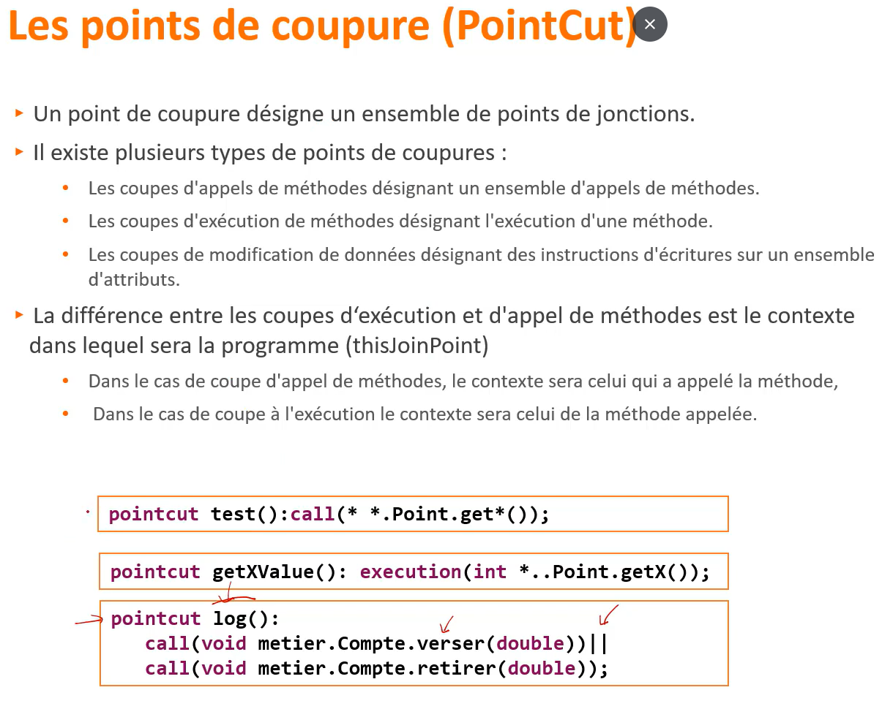

# Spring Aop (Aspect oriented programming)
__`La programmation orientée aspect`__ est un paradigme de programmation qui permet de séparer les __préoccupations transversales__ des __préoccupations métier__, afin de rendre le code plus modulaire, lisible et maintenable.

- Les __`préoccupations transversales`__ (ou __cross-cutting concerns__) regroupent des fonctionnalités techniques comme la journalisation, la gestion des transactions, la sécurité, etc. Ces aspects sont souvent répétitifs et présents dans plusieurs parties de l'application.

- Les __`préoccupations métier`__, quant à elles, constituent le cœur fonctionnel de l'application : ce sont les règles spécifiques à l'activité que l'application implémente. 

La __AOP__ permet de développer ces préoccupations séparément, puis de les réutiliser dans différentes parties du projet. Grâce à des outils appelés __tisseurs d’aspects__ (comme __Spring AOP__ ou __AspectJ__), le code des aspects est combiné automatiquement au code métier au moment de la compilation ou de l'exécution. Cela permet de garder le code métier propre, tout en appliquant les aspects techniques de manière centralisée et non intrusive.

## POO VS POO + AOP

<p align="center">
  
</p>
<p align="center">
  
</p>


## Tisseurs d’aspects (Aspect Weaver)

En __programmation orientée aspect__, un programme est généralement structuré en deux parties distinctes :

- Les __classes métier__, qui contiennent la logique fonctionnelle principale de l’application.

- Les __aspects__, qui encapsulent les préoccupations transversales (techniques), comme la journalisation, la sécurité ou la gestion des transactions.

Le programme  `ne doit pas avoir  connaissances des aspects`  il sont  jamais appellé dans une  class  du programme 
c'est le  but des tisseurs d'aspects  ou  (`aspect  weaver`) ils ont le role de griffer l'ensemble  des aspects sur l'ensembles des classes du  programme 

les tisseurs  d'aspects se différencient sur deux points 
- le langage du programmation utilisé 
- le moment ou  le tissage est réalisé  (compilation , Excuction)

    <p align="center">
    
    </p>

 
## <h2 align="center"> Concepts  de  base de AOP </h2>
- ## __`1. Les points de jonction (JoinPoint):`__ :  
les  points  de jonctions sont des points du  programme autour desquels un ou  des  aspects ont été greffées 
 
  <p align="center">
    
  </p>

- ## __`2. Les points de coupure (): PointCut`__ :
   un point de coupure désigne un ensembe  de points de jonctions   
  <p align="center">
    
    </p>
## Types de Pointcuts (PointCut) en AOP

  En AOP, les pointcuts ciblent des points spécifiques dans l'exécution du programme. Voici les principaux types :

  - **execution()**  
    Cible l'exécution d'une méthode (dans le corps de la méthode).  
    *Supporté par Spring AOP.*

  - **call()**  
    Cible l'appel d'une méthode (l'endroit où la méthode est appelée).  
    *Non supporté par Spring AOP, uniquement AspectJ.*

  - **get() / set()**  
    Cible l'accès ou la modification d'un champ (attribut).

  - **handler()**  
    Cible un bloc `catch` lors de la gestion d'une exception.

  - **initialization() / preinitialization()**  
    Cible la création d'un objet, pendant (initialization) ou juste avant (preinitialization) l’exécution du constructeur.

  - **staticinitialization()**  
    Cible les blocs statiques d'initialisation d’une classe.

  ---

  ### Différence entre execution() et call()

  | Pointcut    | Description                      | Support Spring AOP |
  |-------------|---------------------------------|--------------------|
  | execution() | Exécution de la méthode          | Oui                |
  | call()      | Appel de la méthode              | Non                |


- ## __`3. Wildcard` :__ 
Dans un langage de programmation orienté aspect, il est essentiel de fournir au développeur une structure syntaxique permettant de déclarer des points de coupure (pointcuts).
  - Chaque langage définit sa propre syntaxe pour exprimer ces points de coupure.
  - Les **wildcards** (caractères génériques) permettent de cibler plusieurs méthodes, classes ou signatures à la fois.
  - Elles peuvent être comparées aux expressions régulières, dans le sens où elles permettent de caractériser de manière flexible des portions du programme à intercepter.

Exemple  :
```java
  call (* *..Point.get*(..))
  // * : le  type  de retoure
  // *.: n'import quel package
  // get*() : toutes  les  méthodes qui terminent  par get() 
```

- ## __`4. Les Codes Advices`__

Les blocs **Advices** sont des blocs de code qui exécutent un aspect.  
Les codes Advices caractérisent le comportement de l'aspect.  

Chaque code Advice d'un aspect doit être associé à une coupe (pointcut) pour être exécuté.  
Ils ne seront exécutés que si un événement défini par un point de coupure a été intercepté.  

Un code Advice peut être exécuté selon trois modes :  
- **avant** (before)  
- **après** (after)  
- **autour** (around) d'un point de jonction (join point).
