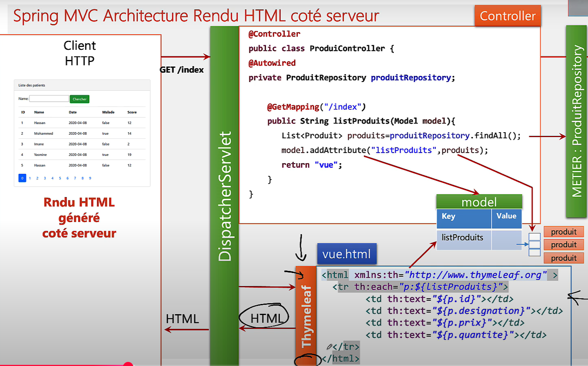
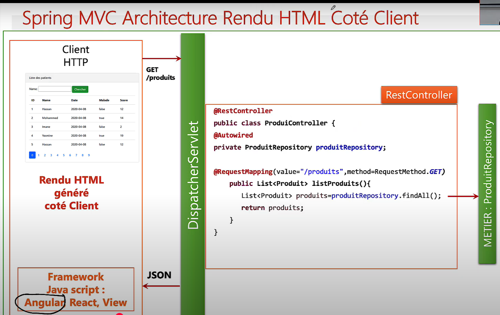

# Spring MVC
Spring MVC (Model-View-Controller) est un module du framework Spring qui permet de créer des applications web en Java suivant le modèle de conception MVC. Il est très utilisé pour construire des API REST ou des applications web classiques côté serveur (avec des vues HTML/JSP).

<p align="center">
  
</p>


## fonctionnement du modéle MVC avec spring MVC


<p align="center">
    
</p>

Spring MVC suit le modèle architectural `Model-View-Controller.` Les données sont préparées dans le modèle (`Model`), puis injectées dans la vue (par exemple via Thymeleaf), et les contrôleurs (`@Controller`) servent à traiter les requêtes, exécuter la logique métier, et retourner la vue à afficher avec les données.


## SERVLET

<p align="center">
    
</p>

- dans les applications  web rendu html  coté  serveur en générale on utilise  `doGet(req ,resp)` ,  `doPost(req,resp)`

- toutes les  classes `My-servlet` doivent hérité d'une  classe `HttpServlet`

```
```

## Différence entre servelet `JEE` et `springMVC` :
✅ Ce que Tomcat attend :
Tomcat est un `Servlet Container`, donc il attend qu’on lui fournisse une ou plusieurs servlets.
Ces servlets doivent être des classes qui étendent `HttpServlet`.

### 🧱 Deux options possibles :
- ### 🔹 Option 1 : Servlet classique Java EE
    - Tu écris ta propre classe qui étend `HttpServlet`.
    - Tu la déclares avec `@WebServlet` ou dans `web.xml`.
    - C’est toi qui gères le traitement des requêtes dans `doGet`, `doPost`, etc.
     ```java
        @WebServlet("/hello")
        public class HelloServlet extends HttpServlet {
        @Override
        protected void doGet(HttpServletRequest req,
               HttpServletResponse       resp) {
        // traitement manuel
            }
        }
     ```
- ### 🔸 Option 2 : Spring MVC
   - Spring fournit une servlet spéciale : __`DispatcherServlet`__ (elle étend HttpServlet aussi).
   - C’est elle qui est enregistrée auprès de Tomcat (automatiquement par Spring Boot ou manuellement dans web.xml).
   - Ensuite, __``DispatcherServlet``__ délègue le travail aux __`@Controller`__.
        ```java
          public class DispatcherServlet extends HttpServlet {
            // gère les requêtes, les routes, les contrôleurs Spring, etc.
            } 
        ```
✅ __DispatcherServlet__ = une servlet __HttpServlet__ Spring qui remplace ta propre servlet manuelle.


```
```


## Déployer une  `servlet` :  (sans springMVC)
pour initiliser  une sevlet  soit  on  la déclare  dans une fichier `web.xml` soit via annotation `@WebServelt (name="test",  urlPaterns="/hello",".do")`

- __via le `web.xml`__

   <p align="center">
        
    </p>


- __via l'annotation `@WebServlet` (annotation JEE)__    

    <p align="center">
        
    </p>


## explication  de urlpattern 
- __"/hello"__ : pour  acceder a  la  page il faut fair __http:localhost...`/hello`__
- __"*.do"__ : __http:localhost...*.do__ : pour aussi acceder à la page 


## Deployer une Servlet :  (Avec SpringMVC) 
Pour déployer une ``servlet`` avec ``Spring MVC``, Spring utilise sa propre logique d'initialisation via le ``DispatcherServlet``.
Ce dernier hérite de ``HttpServlet``, ce qui permet à Spring d’intégrer son propre mécanisme de gestion des requêtes HTTP.

Grâce à cette architecture, Spring offre un ensemble d’annotations telles que ``@Controller``, facilitant la déclaration, l’organisation et le déploiement de nos différents contrôleurs.
Pour en savoir plus, consulte la section  [« Détail des annotations Spring MVC courantes »](#détail-des-annotations-spring-mvc-courantes).


## Correspondance entre l’architecture REST (DAO / Service / Controller) et le modèle MVC
| Composant MVC  | Composant REST (Spring)              | Rôle                                                                     |
| -------------- | ------------------------------------ | ------------------------------------------------------------------------ |
| **Model**      | `Entity`, `Dto`, `DAO`, `Repository` | Gère les **données** et la logique métier (via `@Entity`, `@Repository`) |
| **View**       | JSON / XML / HTML                    | Représentation des données envoyées au client (Spring renvoie du JSON)   |
| **Controller** | `@RestController`                    | Reçoit les requêtes, appelle le service, renvoie une réponse HTTP        |


Pour les APIs, on utilise souvent `@RestController`(qui combine @Controller + `@ResponseBody`).


## utilisation  spring MVC 

- __pour architecture rendu HTML coté Serveur__ 

    <p align="center">
        
    </p>


    Grâce à des moteurs de template comme `Thymeleaf`, il est possible d’injecter directement les données provenant du modèle.
    Le modèle (objet de type `Model`) est fourni par Spring et sert à stocker les informations à transmettre à la vue.
 


- __pour architecture rendu HTML coté Client__ 
  <p align="center">
        
  </p>

   Dans ce cas, les données renvoyées au client sont au format `JSON`, et la vue est construite côté client à l’aide de frameworks JavaScript tels que `Angular` `React`,`Vue`


````
````
## Spring Web 
👉 spring-web ≠ spring-webmvc, même si Spring MVC fait partie de Spring Web.

📌 Détail des différences :
    Élément	Contient quoi ?
    spring-web	Composants de base pour les applis web : support HTTP, RestTemplate, @RequestBody, etc.
    spring-webmvc	Implémentation complète du pattern MVC (Model-View-Controller) : DispatcherServlet, annotations @Controller, @RequestMapping, gestion des vues, etc.

```
  spring-web
│
├── Utilitaires HTTP
├── Sérialisation JSON/XML
└── ─────────────────────────
     ▲
     │
spring-webmvc
├── DispatcherServlet
├── Gestion des vues
├── Mapping des URLs
└── Annotations MVC (@Controller, etc.)


```

Spring Web dans Spring Initializr = un starter complet qui inclut `Spring MVC`, `Spring Web`, `Jackson`, `Tomcat`, etc.

📦 ``Qu'est-ce que spring-boot-starter-web ?``
C’est un starter fourni par Spring Boot.
Il sert à rapporter toutes les dépendances nécessaires pour créer une application web complète (API REST ou MVC classique).
````
````


## 🔍 Détail des annotations Spring MVC courantes

| Annotation                          | Origine                   | Rôle                                                                                              |
| ----------------------------------- | ------------------------- | ------------------------------------------------------------------------------------------------- |
| `@RestController`                   | Spring MVC (`spring-web`) | Combine `@Controller` + `@ResponseBody`, permet de créer des **API REST**                         |
| `@Controller`                       | Spring MVC                | Utilisé dans les applis web traditionnelles (HTML/JSP)                                            |
| `@RequestMapping`                   | Spring MVC                | Mappe une **route HTTP** à une méthode ou un contrôleur                                           |
| `@GetMapping`, `@PostMapping`, etc. | Spring MVC                | Versions spécifiques de `@RequestMapping` pour GET, POST, PUT, DELETE                             |
| `@RequestBody`                      | Spring MVC                | Permet de **lire le corps de la requête HTTP** (souvent JSON) et de le désérialiser en objet Java |
| `@ResponseBody`                     | Spring MVC                | Convertit un objet Java en JSON pour la **réponse HTTP**                                          |
| `@PathVariable`                     | Spring MVC                | Extrait une variable depuis l’**URL**                                                             |
| `@RequestParam`                     | Spring MVC                | Extrait un paramètre depuis l’**URL ou le formulaire**                                            |


## 🌐` @Controller`

Utilisé pour les applications web classiques (avec pages HTML).
Retourne une vue (fichier .html, .jsp, etc.) grâce à un moteur de template comme Thymeleaf.
Le nom retourné correspond à un template à rendre côté serveur.

- 🔸 Exemple :
    ```java
            @Controller
            public class PageController {

                @GetMapping("/home")
                public String home(Model model) {
                    model.addAttribute("user", "Halim");
                    return "home"; // → renvoie home.html
                }
            }

            // Model  est  objet fournit par  spring MVC
    ```
## 📡 @ResponseBody

Utilisé pour envoyer directement une réponse HTTP (souvent du JSON) au lieu d’une vue.
Peut s’ajouter à une méthode ou à un contrôleur classique.

- 🔸 Exemple :
    ```java
            @Controller
            public class ApiController {

                @GetMapping("/api/user")
                @ResponseBody
                public User getUser() {
                    return new User("Halim"); // → renvoie envoie du JSON
                }
            }
    ```

## 📌 Différences fondamentales

| Annotation                               | Ce que retourne la méthode             | Utilisation typique             |
| ---------------------------------------- | -------------------------------------- | ------------------------------- |
| `@Controller` **(sans `@ResponseBody`)** | Le **nom d’une vue** (fichier `.html`) | Applications Web avec templates |
| `@Controller + @ResponseBody`            | Une **donnée brute** (ex: JSON, texte) | API REST, ou retour JSON/XML    |
| `@RestController`                        | Idem (automatiquement des données)     | API REST                        |

