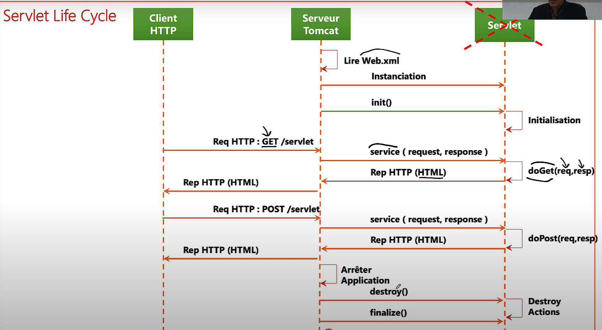

# Tomacat

Tomcat est un serveur d'applications Java. Il reçoit des requêtes HTTP, les traite, et peut exécuter des servlets Java compilées à partir de fichiers JSP, transformés en classes Java.

## fonctionnnement : 
Lorsque le serveur `Tomcat` est démarré, il recherche un fichier nommé `web.xml`.
Ce fichier contient la déclaration de __toutes les servlets__ que l’application utilise.

Tomcat lit ces déclarations, puis instancie chaque servlet (c’est-à-dire qu’il crée les objets correspondants).
Ensuite, il appelle automatiquement la méthode `init()` de chaque servlet pour l’initialiser.

Une fois cette phase terminée, la servlet est chargée en mémoire et reste en attente des requêtes des clients.

Tomcat prend en charge l’ensemble du cycle de vie d’une servlet.
C’est pourquoi on l’appelle un __Servlet Engine__, __Servlet Container__ ou encore __Web Container__.

## En d'autre  terme :

🔧 Le rôle de __Tomcat__ : est de fournir  à l’application un objet appelé __`ServletContext`__.Cet objet permet d’enregistrer, configurer, et initialiser des servlets, des filtres et des listeners.


<p align="center">
    
</p>

🧱 Deux façons d’utiliser ce `ServletContext` :

## 1. __✅ Côté Java EE (Jakarta EE) :__
Utilise des mécanismes standards :
 - `web.xml`
 - annotations comme `@WebServlet`, `@WebFilter`, `@WebListener`
  Ces déclarations sont automatiquement interprétées par Tomcat, qui fait :
    ```java
    servletContext.addServlet(...); // en interne
    ```
exemple : comment  tomcat détecte une classe `HttpServlet`
- #### 📦  Projet Java EE classique (sans Spring)
    Tomcat scanne les classes de ton application à la recherche de :
    - un web.xml avec `servlet` et `servlet-mapping`

    - des classes annotées avec `@WebServlet`

    👉 Il crée ensuite une instance de la classe trouvée (qui étend `HttpServlet`) et la mappe aux URLs.


## ✅ Côté Spring Boot :
N’utilise ni `web.xml`, ni `@WebServlet`
Mais appelle directement le `ServletContext` en Java pur, grâce à une interface créée par Spring Boot :`ServletContextInitializer` via la  class __`HttpServlet` de JEE__

exemple : comment tomcat détecte une classe HttpServlet

- #### 🌱 1. Projet Spring MVC (sans Spring Boot)

    Tu dois enregistrer manuellement la `DispatcherServlet`, par exemple :
    - dans `web.xml`
    - ou avec une classe Java qui étend `AbstractAnnotationConfigDispatcherServletInitializer`

    👉 C’est toi qui fais le lien entre Tomcat et la `DispatcherServlet`.

- ### 🚀 2. Projet Spring Boot (moderne) 
    C’est Spring Boot lui-même qui :
    - démarre un Tomcat embarqué (via la dépendance `spring-boot-starter-web`)
    - instancie et enregistre automatiquement la `DispatcherServlet` (qui étend `HttpServlet`)
    - configure le mapping / sans `web.xml` ni `@WebServlet`


**Tomcat fournit une classe `ServletContext` que JEE exploite à travers `HttpServlet`.**

- **Spring/Spring Boot** : Hérite de `HttpServlet` et propose sa propre configuration et utilisation, notamment à travers la classe `DispatcherServlet`. Cela permet à Spring d'utiliser `HttpServlet` tout en fournissant un mécanisme spécifique pour gérer les requêtes HTTP.

- **JEE (Java EE)** : Fournit des mécanismes comme `@WebServlet` et `web.xml` qui permettent de déclarer des servlets. Ces servlets héritent également de `HttpServlet` et sont configurées via des annotations ou un fichier XML, en fonction de la méthode choisie.

En résumé :
- **Spring/Spring Boot** et **JEE** utilisent `HttpServlet`, mais chacun offre sa propre configuration et son propre moyen de déclarer et gérer des servlets (`DispatcherServlet` pour Spring et `@WebServlet` ou `web.xml` pour JEE).


````
````


## Serveur d'application VS Serveur web

- 🔹 __Serveur web__ : (comme `Apache HTTP`Server ou `Nginx`) est conçu pour servir du contenu statique ou rediriger des requêtes vers des applications.

    -   📄 Sert des fichiers statiques : HTML, CSS, JS, images

    -   📥 Gère des requêtes HTTP simples

    -   🔁 Peut transmettre les requêtes à un serveur d'application via reverse proxy (ex: /api, /login, etc.)

- 🔸 __Serveur d'application__ : (comme `Tomcat`, `JBoss`, `GlassFish`) est conçu pour exécuter 
du code côté serveur (souvent Java, mais aussi .NET, Python, etc.)

- 🧠 __En résumé__ :

    | Aspect             | Serveur Web                | Serveur d'Application       |
    | ------------------ | -------------------------- | --------------------------- |
    | Contenu servi      | Statique                   | Dynamique                   |
    | Langage            | Aucun (HTML/CSS/JS)        | Java, .NET, Python, etc.    |
    | Exemple            | Apache, Nginx              | Tomcat, WildFly, GlassFish  |
    | Objectif principal | Réponse rapide de fichiers | Exécution de logique métier |


## Filter Tomcat 
`Tomcat`, tout comme chaque conteneur web, prend en charge le concept de `Filter`, défini par les spécifications Java EE (aujourd'hui Jakarta EE).

Un filtre permet d'intercepter toutes les requêtes HTTP (ou certaines) avant qu'elles n'atteignent une servlet (comme le `DispatcherServlet`de Spring ou une `HttpServlet` classique).
Autrement dit, avant que Tomcat ne transmette la requête à la servlet, il peut appliquer une chaîne de filtres pour analyser, modifier ou valider la requête HTTP.


__📌 Rôle d’un Filter__
-   Ajouter des en-têtes HTTP

-   Journaliser (logs) les requêtes

-   Gérer la sécurité (authentification)

-   Compresser/décompresser

-   Gérer le CORS

-   Modifier la requête ou la réponse


__🔁 Cycle de traitement__

````
    [Client HTTP]
          ↓
      [Tomcat]
        ↓
    [Filter1] → [Filter2] → … → [DispatcherServlet or HttpServlet]
                                          ↓
                                     [Controller]
````


__✅ Exemple de Filter__

```java
    @WebFilter(urlPatterns = "/*")
    public class MyLoggingFilter implements Filter {
        public void doFilter(ServletRequest request, ServletResponse response, FilterChain chain)
                throws IOException, ServletException {
            System.out.println("🔍 Requête interceptée : " + ((HttpServletRequest) request).getRequestURI());
            chain.doFilter(request, response); // Continue vers le prochain filtre ou la servlet
        }
    }
```

👉 Ce filtre affiche chaque URI de requête entrante.


## Configuration de Tomcat dans Spring Boot
Voici une liste des propriétés que vous pouvez utiliser pour configurer Tomcat dans une application Spring Boot via le fichier `application.properties` ou `application.yml`.

### 1. Serveur HTTP Port
- **Propriété**: `server.port`
- **Description**: Détermine le port d'écoute du serveur Tomcat. Par défaut, Spring Boot démarre le serveur Tomcat sur le port 8080.
  
    ```properties
    server.port=8081
    ```
### 2. Contexte du Serveur
- **Propriété**: `server.servlet.context-path`
- **Description**: Permet de spécifier un chemin de contexte pour l'application (par exemple, /app), ce qui signifie que toutes les URL de l'application commenceront par ce chemin.
  
    ```properties
    server.servlet.context-path=/app
    ```    

### 3. Temps d'attente de la connexion
- **Propriété**: `server.connection-timeout`
- **Description**: Définit le temps d'attente maximum pour les connexions. Cela peut être utile pour les serveurs avec un grand nombre de connexions simultanées.
  
    ```properties
   server.connection-timeout=20000  # en millisecondes
    ```        

### 4. Limite de taille maximale pour les requêtes
- **Propriété**: `server.tomcat.max-http-post-size`
- **Description**: Spécifie la taille maximale autorisée pour les requêtes POST en bytes. Par défaut, cette limite est fixée à 2 Mo.
  
    ```properties
    server.tomcat.max-http-post-size=2097152  # 2MB
    ```    

### 5. Configurer la taille du buffer pour les requêtes
- **Propriété**: `server.tomcat.max-http-header-size`
- **Description**:  Spécifie la taille maximale du buffer pour les en-têtes HTTP. Cela permet de contrôler la taille des en-têtes acceptés par Tomcat.
  
    ```properties
   server.tomcat.max-http-header-size=16384  # 16 KB
    ``` 

### 6. Activer l'enregistrement des logs des accès
- **Propriété**: `server.tomcat.accesslog.enabled`
- **Description**:  Permet d'activer ou de désactiver l'enregistrement des logs d'accès HTTP dans Tomcat.
  
    ```properties
   server.tomcat.accesslog.enabled=true
    ```    

### 7. Configurer le fichier de log de Tomcat
- **Propriété**: `server.tomcat.accesslog.directory`
- **Description**:   Spécifie le répertoire où les logs d'accès de Tomcat doivent être enregistrés,Ces logs enregistrent des informations sur les requêtes HTTP que Tomcat reçoit. Cela inclut des détails comme :
    -   `L'adresse IP du client`,  `Le type de requête (GET, POST, etc.)`,`Le chemin de l'URL ,demandée`, `Le statut HTTP retourné`, `Le temps mis pour traiter la requête`
    ```properties
   server.tomcat.accesslog.directory=/path/to/logs
    ```      

### 8. Format du log d'accès
- **Propriété**: `server.tomcat.accesslog.pattern`
- **Description**:   Détermine le format du log d'accès. Vous pouvez spécifier un format personnalisé ou utiliser un format par défaut.
  
    ```properties
        server.tomcat.accesslog.pattern=%h %l %u %t "%r" %s %b
    ```      


### 9. Mode HTTP (HTTP/2)
- **Propriété**: `server.http2.enabled`
- **Description**: Permet d'activer ou de désactiver le support HTTP/2. Le support HTTP/2 peut améliorer les performances, mais nécessite que le serveur soit configuré pour cela.
  
    ```properties
  server.http2.enabled=true
    ```        


### 10. Répertoire de travail temporaire de Tomcat
- **Propriété**: `server.tomcat.basedir`
- **Description**:  Spécifie le répertoire de travail de Tomcat, qui est utilisé pour stocker les fichiers temporaires générés par le serveur,Tomcat a besoin d’un répertoire temporaire pour stocker certains fichiers à la volée pendant l’exécution de l’application. Ce répertoire peut contenir :
    -  Des fichiers temporaires liés au traitement des requêtes.
    -  Des versions compilées de JSP.
    -  Des données de déploiement transitoires.

  🔒  __À noter__ :
Ce répertoire n’est pas censé contenir de fichiers permanents. Il peut être vidé sans risque au redémarrage. Il sert uniquement au fonctionnement interne de Tomcat.


    ```properties
    server.tomcat.basedir=/path/to/tomcat
    ```      

### 11. Activer la gestion des sessions
- **Propriété**: `server.session.persistent`
- **Description**:  Active ou désactive la persistance des sessions. Si activée, les sessions sont sauvegardées entre les redémarrages du serveur.
  
    ```properties
   server.session.persistent=true
    ```      


### 12. Durée d'expiration de la session
- **Propriété**: `server.session.timeout`
- **Description**:  Définit la durée d'expiration des sessions en minutes. Après ce délai, la session sera invalide.
  
    ```properties
   server.session.timeout=30m  # 30 minutes
    ```      


### 13. Réduire le délai de démarrage de Tomcat
- **Propriété**: `server.tomcat.startup-timeout`
- **Description**:  Définit la durée maximale avant que Tomcat ne soit prêt à accepter des requêtes.
  
    ```properties
   server.tomcat.startup-timeout=30s
    ```      


### 14. Compression des réponses HTTP
- **Propriété**: `server.http2.enabled`
- **Description**: Active ou désactive la compression des réponses HTTP. Cela peut être utile pour réduire la taille des réponses envoyées aux clients.
  
    ```properties
     server.compression.enabled=true
    ```            


### 15. Activer l'usage de l'interface JMX pour Tomcat
- **Propriété**: `server.tomcat.jmx-enabled`
- **Description**:  Permet d'activer ou de désactiver la gestion via JMX pour Tomcat.
  
    ```properties
   server.tomcat.jmx-enabled=true
    ```      

### 16. Configurer la compression GZIP pour Tomcat
- **Propriété**: `server.tomcat.gzip-enabled`
- **Description**:  Permet de compresser les réponses HTTP avec GZIP. Cela est utile pour réduire la taille des réponses envoyées aux clients.
  
    ```properties
        server.tomcat.gzip-enabled=true
    ```      

### 17. Méthode de compression (type MIME)
- **Propriété**: `server.compression.mime-types`
- **Description**: Spécifie les types MIME qui doivent être compressés. Par exemple, vous pouvez compresser les fichiers JavaScript, CSS et HTML.
  
    ```properties
     server.compression.mime-types=text/html,text/xml,application/json,application/javascript,text/css
    ```                

  