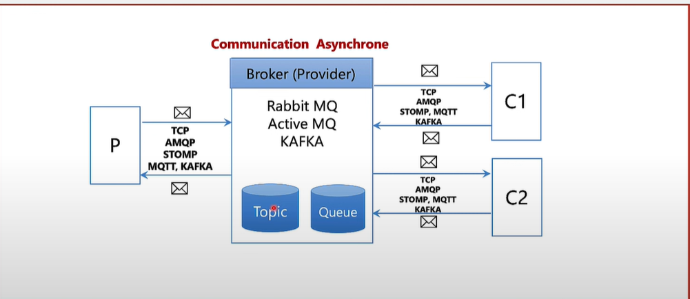

# Asynchronous System

Les systèmes de distribution **asynchrones** reposent souvent sur un **broker** : un outil intermédiaire chargé de gérer la communication entre plusieurs applications.

### Fonctionnement

1. L'**application A** (le producteur) envoie un message au **broker**.
2. Le broker stocke ce message dans un **topic** (mode publication/abonnement) ou une **queue** (file d’attente).
3. Le broker vérifie si l'**application B** (le consommateur) est disponible :
   - ✅ Si elle est disponible, le message est immédiatement transmis.
   - ❌ Sinon, le message est conservé jusqu’à ce que l’application B soit prête à le recevoir.

### Avantages

- 🔄 **Découplage** entre producteurs et consommateurs.
- 💡 **Résilience** : les messages ne sont pas perdus si le consommateur est temporairement indisponible.
- 📈 **Scalabilité** : plusieurs consommateurs peuvent traiter les messages en parallèle.

### Exemples de brokers

- Apache Kafka
- RabbitMQ
- ActiveMQ
- Redis Streams

    

## Différence entre **Queue** et **Topic**

- **Queue** (file d’attente) :  
  Un message envoyé dans une queue est reçu par **un seul consommateur**.  
  Exemple : Une tâche à faire, qu’un seul worker doit exécuter.

- **Topic** (sujet/abonnement) :  
  Un message envoyé sur un topic est reçu par **tous les abonnés**.  
  Exemple : Une info météo envoyée à tous les utilisateurs abonnés.

---

### En résumé :

- **Queue** = un message → un consommateur  
- **Topic** = un message → plusieurs consommateurs
