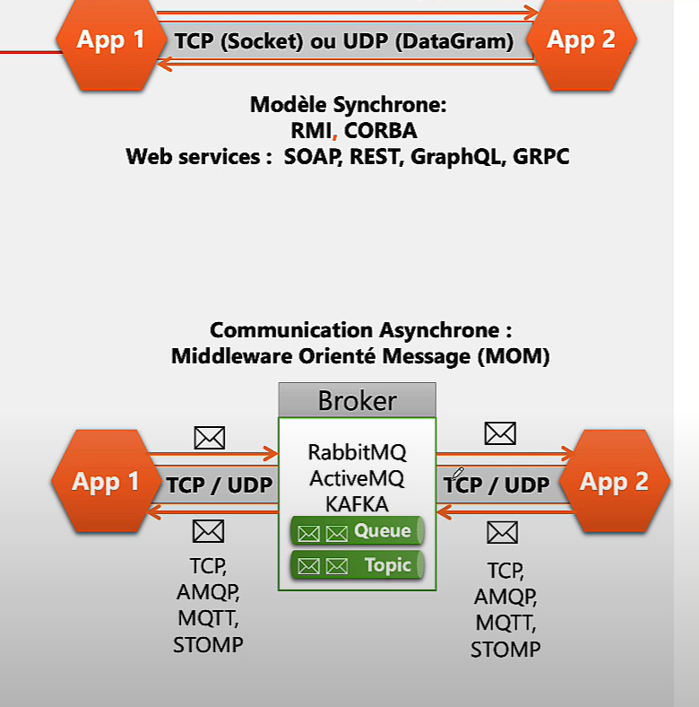

# <h1 align="center"> Web Serices</h1>
Un web service est une interface qui permet à une application A de communiquer avec une application B à travers un réseau, en utilisant généralement des formats standardisés comme `XML` ou `JSON`, et le plus souvent via le protocole `HTTP`.

## 🧩 Modèle de communication
Il existe deux modèles de communication entre applications :

<p align="center">
    
</p>


---

### 🔄 Communication synchrone

Dans ce modèle, lorsqu'une application **A** envoie une requête à l'application **B**, elle reste **bloquée** tant que **B n'a pas répondu**.

👉 Cela signifie que **A attend la réponse de B** avant de continuer son exécution.

---

### 📨 Communication asynchrone

Dans ce modèle, les applications communiquent **de manière indirecte** à l’aide d’un **broker** (ou **intermédiaire**), qui joue le rôle de **serveur de messagerie** entre elles.

#### 🛠️ Fonctionnement :
- Lorsque l’application **A** souhaite communiquer avec l’application **B**, elle envoie un message au **broker**.
- Le **broker** vérifie si **B est disponible** :
  - ✅ **Si oui** : le message est immédiatement transmis à **B** (*on parle alors de messagerie instantanée*).
  - ❌ **Si non** : le message est **stocké** dans une "boîte aux lettres" (ou **file d’attente**) jusqu’à ce que **B devienne disponible**.

👉 Ce modèle permet à l’application **A** de **continuer son exécution immédiatement**, sans attendre la réponse de **B**.

---
pour faire  communiquer les systems distribuer  il  faut utiliser  des  __`middleware`__

__`middleware`__ :  c'est  une  couche  logicielle intermédaire qui permet  aux  applications  distribuées de  communiquer de manière transparentes 
- Deux Modèle  de Middlewares 
    - **Synchrone** : 
        - __`RMI (Remote Method Invocation)`__ : c'est un middlware qui  permet de  creer des  application orienté  objets distribuee (plusieurs application  java )

           -  **``Serveur RMI :``**  
                ```java
                import java.rmi.registry.LocateRegistry;
                import java.rmi.registry.Registry;
                public class Server {
                    public static void main(String[] args) {
                        try {
                            // on  creer  un object  java 
                            HelloImpl obj = new HelloImpl();

                            // Démarre le registre RMI sur le port 1099
                            Registry registry = LocateRegistry.createRegistry(1099);

                            // Lie l'objet distant au nom "Hello"
                            registry.rebind("Hello", obj);

                            System.out.println("Serveur prêt.");
                        } catch (Exception e) {
                            System.err.println("Erreur du serveur : " + e);
                        }
                    }
                }
                ```   
            -  **``Client RMI :``**        
                ```java        
                    import java.rmi.registry.LocateRegistry;
                    import java.rmi.registry.Registry;

                    public class Client {
                        public static void main(String[] args) {
                            try {
                                // Localise le registre RMI sur localhost et port 1099
                                Registry registry = LocateRegistry.getRegistry("localhost");

                                // Cherche l'objet distant nommé "Hello"
                                Hello stub = (Hello) registry.lookup("Hello");

                                // Appelle la méthode distante
                                String response = stub.sayHello();
                                System.out.println("Réponse du serveur : " + response);
                            } catch (Exception e) {
                                System.err.println("Erreur du client : " + e);
                            }
                        }
                    }                
                ```
        - __`CORBA (Common Object Request Broker Architecture)`__  : est un middleware qui permet de créer des applications distribuées orientées objet, multilangages et multiplateformes. Il facilite la communication entre des objets situés sur des machines différentes, même s'ils sont écrits dans des langages de programmation différents et s'exécutent sur des systèmes d'exploitation variés.

            __🌐 Exemple simple d’utilisation de CORBA en Java__
            ORBA utilise l'IDL (Interface Definition Language) pour définir les interfaces.

            1. Interface IDL (Hello.idl) : 
                 ```idl 
                        module HelloApp {
                            interface Hello {
                                string sayHello();
                            };
                        };
                ```

            2. Compilation de l’IDL : Cela génère des fichiers Java dans des dossiers comme HelloApp.
                ```bash
                    idlj -fall Hello.idl
                ```

           3. Implémentation du serveur
           ```java
                import HelloApp.*;
                import org.omg.CORBA.*;
                import org.omg.PortableServer.*;

                public class HelloServer {
                    public static void main(String[] args) {
                        try {
                            ORB orb = ORB.init(args, null);
                            POA rootpoa = POAHelper.narrow(orb.resolve_initial_references("RootPOA"));
                            rootpoa.the_POAManager().activate();

                            HelloImpl helloImpl = new HelloImpl();
                            org.omg.CORBA.Object ref = rootpoa.servant_to_reference(helloImpl);
                            Hello href = HelloHelper.narrow(ref);

                            org.omg.CORBA.Object objRef = orb.resolve_initial_references("NameService");
                            NamingContextExt ncRef = NamingContextExtHelper.narrow(objRef);
                            ncRef.rebind(ncRef.to_name("Hello"), href);

                            System.out.println("Serveur prêt...");
                            orb.run();
                        } catch (Exception e) {
                            e.printStackTrace();
                        }
                    }
                }

                class HelloImpl extends HelloPOA {
                    public String sayHello() {
                        return "Bonjour depuis le serveur CORBA !";
                    }
                }

           ```

         4. Implémentation du client
            ```java 
                    import HelloApp.*;
                    import org.omg.CORBA.*;
                    import org.omg.CosNaming.*;

                    public class HelloClient {
                        public static void main(String[] args) {
                            try {
                                ORB orb = ORB.init(args, null);
                                org.omg.CORBA.Object objRef = orb.resolve_initial_references("NameService");
                                NamingContextExt ncRef = NamingContextExtHelper.narrow(objRef);

                                Hello helloImpl = HelloHelper.narrow(ncRef.resolve_str("Hello"));
                                System.out.println("Réponse du serveur : " + helloImpl.sayHello());
                            } catch (Exception e) {
                                e.printStackTrace();
                            }
                        }
                    }        
            ```

        - __`Web Services`__ :  c'est  des  middleware qui permet de faire  comminuquer  des  applications,  en  exploitant le protocole `http` il existe 4  modèle 
            1. **SOAP (Simple Object Access Protocol)** : (http1.1 + XML) c'est  une  commnuication  entre deux  appliaction  via le protocole `HTTP`  en  vihéculant  des donnes  format `XML`

                🧪 Exemple simple de Web Service SOAP en Java (JAX-WS)
                1. `Service Web`(HelloService.java)
                    ```java
                        import javax.jws.WebMethod;
                        import javax.jws.WebService;

                        @WebService
                        public class HelloService {
                            @WebMethod
                            public String sayHello(String name) {
                                return "Bonjour " + name + " !";
                            }
                        }
                    ```
                2. `🧼 Exemple de requête SOAP`
                    ```xml
                    <soapenv:Envelope xmlns:soapenv="http://schemas.xmlsoap.org/soap/envelope/"
                                    xmlns:ws="http://ws/">
                    <soapenv:Header/>
                    <soapenv:Body>
                        <ws:sayHello>
                            <arg0>Halim</arg0>
                        </ws:sayHello>
                    </soapenv:Body>
                    </soapenv:Envelope>
                    
                    ```
                ✅ `SOAP` n'est pas le protocole HTTP lui-même, mais la façon dont les données sont structurées et envoyées via HTTP.

             2. **REST (HTTP/1.1, JSON, XML)** : `REST` (Representational State Transfer) est un style d’architecture permettant la communication entre systèmes distribués via le protocole `HTTP`.
             Il repose sur les méthodes HTTP standards (GET, POST, PUT, DELETE) et utilise souvent le format `JSON` (ou `XML`) pour échanger des données. 
                ```http
                Requête HTTP :
                        POST /api/bonjour HTTP/1.1
                        Host: exemple.com
                        Content-Type: application/json

                        {
                            "nom": "Halim"
                        }
                
                Réponse HTTP :

                HTTP/1.1 200 OK
                Content-Type: application/json

                {
                "message": "Bonjour Halim"
                }

                ```
            3. **GraphQL (HTTP/1.1, JSON)** est un langage de requête développé par Facebook, qui permet aux clients de demander exactement les données dont ils ont besoin, via une seule requête `HTTP`, souvent en POST.Contrairement à REST qui expose plusieurs endpoints (/users, /products, etc.), GraphQL n'utilise qu’un seul endpoint (souvent /graphql) et laisse le client définir la structure de la réponse.       
                ```http
                Requête HTTP :

                    POST /graphql HTTP/1.1
                    Host: exemple.com
                    Content-Type: application/json

                    {
                    "query": "{ bonjour(nom: \"Halim\") }"
                    }

                Réponse HTTP :

                    HTTP/1.1 200 OK
                    Content-Type: application/json

                    {
                    "data": {
                        "bonjour": "Bonjour Halim"
                    }
                    }
                ```  
            4.  **gRPC (Google Remote Procedure Call)** : est un framework open
                 source développé par Google, permettant la communication rapide et efficace entre applications distribuées via le protocole `HTTP/2`
                 Il utilise le langage `Protocol Buffers (protobuf)` pour définir les services et les messages échangés, ce qui rend les échanges binaire, compacts, et très performants.         `gRPC` supporte plusieurs langages et facilite la création de services RPC (Remote Procedure Call) avec un contrat strict.   
                 ```proto
                 
                    syntax = "proto3";
                    package example;

                    // Définition du service
                    service BonjourService {
                    // Méthode qui prend un message HelloRequest et retourne un HelloResponse
                    rpc SayHello (HelloRequest) returns (HelloResponse);
                    }

                    // Message de requête
                    message HelloRequest {
                    string nom = 1;
                    }

                    // Message de réponse
                    message HelloResponse {
                    string message = 1;
                    }
                 ```      

                🔁 Différences entre `HTTP/1.1` et `HTTP/2`

                - 🔸`HTTP/1.1` :La communication se fait dans un seul sens à la fois :

                    D'abord, le client envoie une requête.

                    Ensuite, le serveur répond.

                    Impossible d'envoyer plusieurs requêtes en parallèle sur une même connexion TCP sans blocage (head-of-line blocking).

                    Chaque ressource (image, script, etc.) nécessite souvent une nouvelle connexion.

                    ➡️ Limitations : plus lent, surtout pour les applications web riches en ressources.

                - 🔸`HTTP/2` :communication full-duplex et multiplexée:
                    La communication est bidirectionnelle :

                    Le client et le serveur peuvent envoyer des messages en parallèle, sans attendre que l’autre ait fini.

                    Multiplexage : plusieurs requêtes et réponses peuvent être envoyées simultanément sur une même connexion TCP.

                    Les données sont envoyées sous forme de frames binaires plus performantes.

                    Supporte également la priorisation des requêtes et le server push (le serveur peut envoyer des ressources sans que le client les demande).

                    ➡️ Avantages : bien plus rapide, surtout pour les sites modernes, et mieux optimisé pour les communications entre services.

    - Asynchrone    
